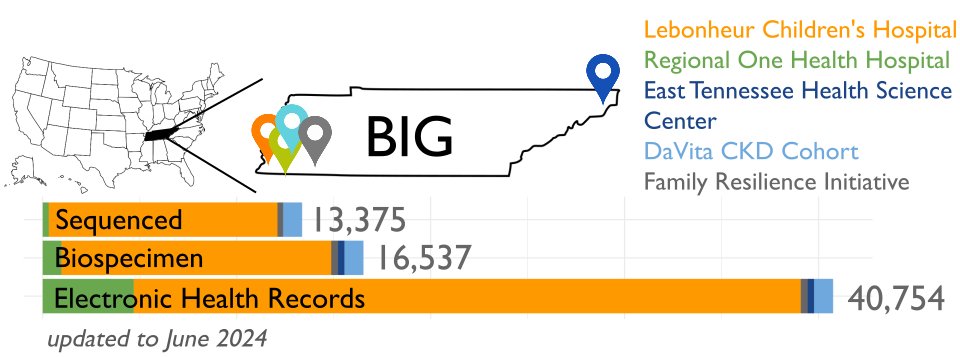
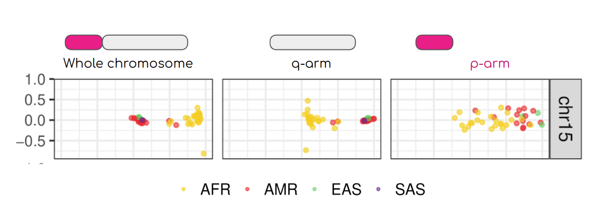
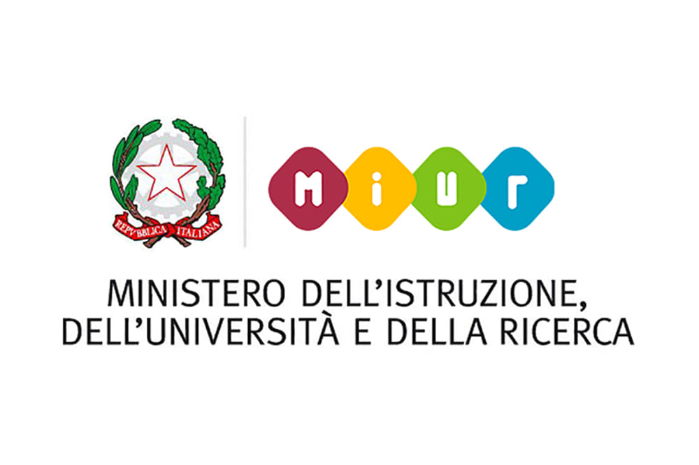
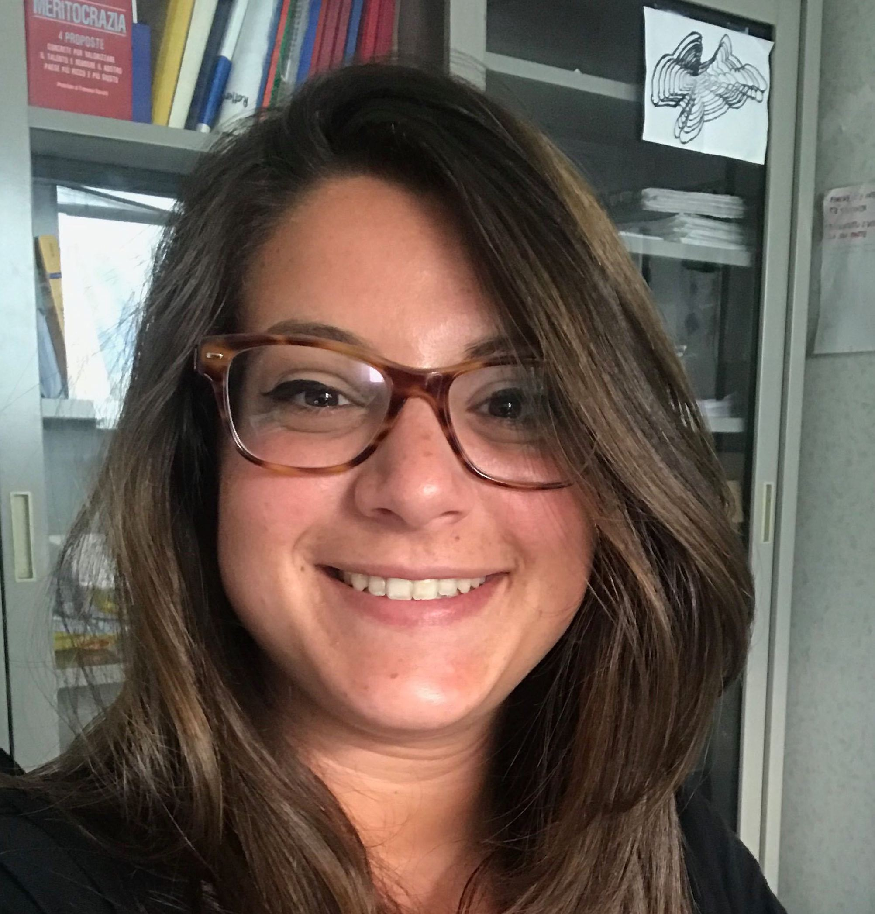
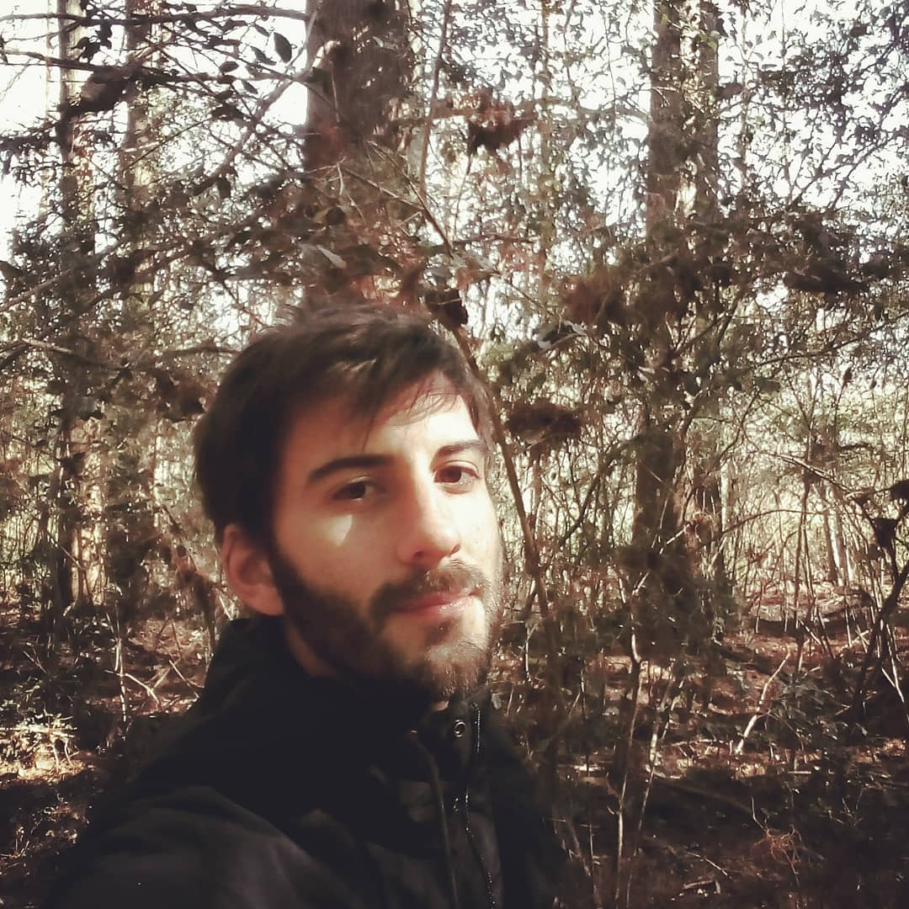

= *Colonna Lab*
:figure-caption!:
:toc-title: Page Content
:toc: left
:toclevels: 1
:hide-uri-scheme:
:docinfo: shared

*Welcome to the Population Genomics Laboratory* +
*Department of Genetics, Genomics and Informatics*

image:images/used/spock.jpg[spock]

We are interested in understanding causes and consequences of genetic
diversity and how natural selection in humans affects loci related to
diseases.

____
_Fascinating (Lieutenant Spock)_
____

== *Research*

=== *Population Genomics and Health Equity*

==== *The Biorepository and Integrative Genomics (BIG) Initiative in Tennessee*

The Biorepository and Integrative Genomics (BIG) Initiative in Tennessee
has developed a pioneering resource to address gaps in genomic research
by linking genomic, phenotypic, and environmental data. BIG is
recruiting participants mainly from Memphis, TN, with plans to include a
total of 100,000 samples over the next five years.

* BIG is partnering with the
https://www.genomicinformationcommons.org/[Genomic Information Commons],
a consortium of top children's hospitals, to conduct genomics research
aimed at discovering the genetic foundations of human disease in diverse
populations.
* BIG is part of the Togheter for Change initiative
https://thedhgi.org/en/about-t4c[(T4C)]

==== *Characterizing Genetic Diversity in the BIG Cohort*

Analysis of 13,152 genomes from BIG revealed significant genetic
diversity, with 50% of participants inferred to have non-European or
various types of admixed ancestry, highlighting the importance of
inclusive genomics in understanding health equity.

image:images/used/website2025/big_admix.png[BIG admixture analysis]

_Global ancestry deconvolution of 13,152 sequenced individuals, based on
reference populations in the 1000 Genomes and HGDP data sets. Each
vertical bar represents one individual, colors are proportional to
inferred ancestry. Individuals were further grouped based on the
ancestry proportions in seven categories based on the likelihood of
similarity to reference populations (AFR= Africans; EUR-AFR = Europeans
Africans admixed; EUR = Europeans; EUR-AMR = Europeans Americans
admixed; Multiway = more than two ancestries; number of individuals per
category in parentheses). See the open access
https://www.nature.com/articles/s41467-025-59375-0[paper]._

==== *Identity-by-Descent as a Window into Shared Environment and Health*

We use identity-by-descent
https://en.wikipedia.org/wiki/Identity_by_descent[(IBD)] sharing
patterns in the BIG cohort to identify recent shared ancestry and
fine-scale population structure. These patterns help connect inherited
genomic segments with shared environmental exposures and disease risk.

=== *Population Pangenomics*

A pangenome is a comprehensive collection of all the genetic variation
present in a species, which overcomes the limitations of reference-based
genomics by including both common and rare genetic variations in a
single reference genome.

The https://humanpangenome.org/[Human Pangenome Reference Consortium]
aims to sequence 300 people to create a pangenome of 600 haplotypes and
has currently released a first draft of the human pangenome reference
based on 47 phased diploid assemblies from a group of genetically
diverse individuals

==== *Uncharted Genomes*

Our team evaluated, for the first time, human population structure using
markers from short arms of the acrocentric chromosomes [PMID:
https://pubmed.ncbi.nlm.nih.gov/37165242/[37165242]]. We found that
markers from these regions have less power to distinguish populations
compared to other regions. This is consistent with the understanding
that short arms of acrocentric chromosomes undergo recombination between
non-homologous chromosomes, similar to the X and Y pseudohomologous
regions [PMID: https://pubmed.ncbi.nlm.nih.gov/37165241/[37165241]]. Our
findings on the patterns of linkage disequilibrium in these regions
support this idea.

_Well-known population stratification is not visible in the p-arms of
acrocentric chromosomes. This observation is compatible with
recombination occurring between the p-arms of heterologous acrocentric
chromosomes. Here is an example of chromosome 15, PCA with markers from
the whole chromosome, only the q-arm, only the p-arm. AFR: Africans;
AMR: Native Americans; EAS: East-Asians; SAS: South-East Asians._

==== *Pangenomics tools for population genetics*

==== *Bat's pangenomics*

=== *Genomics of early embryonic development*

==== *How natural selection acts on early human development*

We investigate adverse outcomes of embryonic development like recurrent
pregnancy loss and preeclampsia to identify the genetic factors that
influence reproductive outcomes and pregnancy complications. This
knowledge furthers our understanding of human evolution and informs
efforts to improve pregnancy outcomes.

image:images/used/embryo.png[embryo]

In *CABERNET* we aim to determine the extent of chromosomal mosaicism
between embryonic and extraembryonic tissues using single cell DNA
sequencing. +
In *DELIVER / NEONATE* we want to identify genetic factors contributing
to reproductive failure and recurrent miscarriage. We will use single
cell strand sequencing to map balanced rearrangements and whole genome
sequencing of euploid miscarried embryos to identify causative
variants. +
In *CANDLE* we want to uncover gene expression patterns associated with
_APOL1_ risk alleles and preeclampsia in African American women. We will
examine the role of ancestry in mediating the relationship between
_APOL1_ genotype and preeclampsia risk. The results can provide insights
into genetic and molecular basis of preeclampsia.

This project is in collaboration with
https://scholar.google.at/citations?user=ceRslzAAAAAJ&hl=en[Francesca
Antonacci] University of Bari Aldo Moro;
https://scholar.google.at/citations?user=02eKUFwAAAAJ&hl=en&oi=ao[Carlo
Alviggi], University of Naples Federico II;
https://www.igb.cnr.it/index.php/marcella-vacca/[Marcella Vacca], and
https://www.igb.cnr.it/index.php/gabriella-lania/[Gabriella Lania],
National Research Council

===== *Funding*

* PRIN 2020J84FAM Ministero dell'Universita e della Ricerca
* PRIN 2022WEHP7M Ministero dell'Universita e della Ricerca
* PRIN P2022ZE75A Ministero dell'Universita e della Ricerca

image:images/used/loghi_grep.png[loghi_grep]

== *Current Members*

=== *Vincenza Colonna*

image:images/used/website2025/enza_2025.jpg[Vincenza Colonna]

*Associate Professor, Department of Genetics, Genomics and Informatics*
https://www.uthsc.edu/faculty/profile/?netid=vcolonna[website] +
_University of Tennessee Health Science Center, Memphis, TN_

*Director, Integrative Genomics Biorpository, Department of
Pediatrics* +
_Children's Foundation Research Institute, Memphis, TN_

*Senior Researcher (on leave of absence), National Research Council*
https://www.igb.cnr.it/index.php/vincenza-colonna/[website] +
_Institute of Genetics and Biophysics, Naples, Italy_

_I graduated in Evolutionary Biology from the University of Naples
Federico II and did postdoctoral research at the University of Ferrara
(Italy) and at Wellcome Trust Sanger Institute in Cambridge (UK). I was
lectures in Genetics and Bioinformatics at the University of Ferrara
(Italy). I am now leading the Population genomics laboratory at the
University of Tennessee, College of Medicine, in the Department of
Genetics, Genomics and Informatics._

https://orcid.org/0000-0002-3966-0474[ORCID] |
https://github.com/ezcn[My GitHub] |
https://scholar.google.com/citations?user=ufP1EYgAAAAJ&hl=en&oi=ao[Google
Scholar]

I am a genomicist and an expert in human evolutionary and population
genomics and bioinformatics. In my postdoctoral research I was part of
the international consortium 1000 Genomes[PMID:
https://pubmed.ncbi.nlm.nih.gov/26432245/[26432245];
https://pubmed.ncbi.nlm.nih.gov/23128226/[23128226]] where I led
contributions to two specific aspects. First, I contributed to develop
FunSeq [PMID: https://pubmed.ncbi.nlm.nih.gov/24092746/[24092746]], a
tool that integrates non-coding information from relevant biological
databases for the functional characterization of non-coding variants.
Second, I lead a genome-wide scan to identify genomic regions with
exceptionally high levels of population differentiation [PMID:
https://pubmed.ncbi.nlm.nih.gov/24980144/[24980144]] demonstrating that
these regions are enriched for positive selection events and that one
half may be the result of classic selective sweeps. Findings from both
sub-projects have since been applied to demographic inference and the
molecular diagnosis of cancer and myeloid malignancies [PMID:
https://pubmed.ncbi.nlm.nih.gov/27121471/[27121471],
https://pubmed.ncbi.nlm.nih.gov/22446628/[22446628]], and to deeper
studies on positive selection at the ABCA12 gene [PMID:
https://pubmed.ncbi.nlm.nih.gov/30890716/[30890716]].

During my PhD I worked on human isolated populations contributing to
characterize several isolated populations, describing the genomic
consequences of isolation [PMID:
https://pubmed.ncbi.nlm.nih.gov/17476112[17476112],
https://pubmed.ncbi.nlm.nih.gov/19550436[19550436],
https://pubmed.ncbi.nlm.nih.gov/22713810[22713810]], contributing to
genetic association studies [PMID:
https://pubmed.ncbi.nlm.nih.gov/16611673[16611673],
https://pubmed.ncbi.nlm.nih.gov/18162505[18162505]] and to characterize
rare variation [PMID:
https://pubmed.ncbi.nlm.nih.gov/28643794[28643794]]

I founded and led http://www.igb.cnr.it/obilab[OBiLab], a project on
training in Bioinformatics

=== *Silvia Buonaiuto*, Postdoctoral fellow

_I am a postdoctoral researcher at the University of Tennessee Health
Science Center in the Department of Genetics, Genomics, and Informatics.
Prior to this, I worked as a postdoctoral researcher at the National
Research Council in Italy. I earned a Ph.D. in Molecular Bioscience from
the University of Campania "Luigi Vanvitelli." Before that, I completed
my Master's degree in Biology at the University of Naples Federico II,
where I conducted my thesis in molecular biology at the Department of
Biology._

https://github.com/SilviaBuonaiuto[My GitHub] |
https://scholar.google.com/citations?user=oGGUawcAAAAJ&hl=it&oi=ao[Google
Scholar]

I work on admixture mapping and pangenomics analysis in the BIG project,
with a focus on connecting genotypes and phenotypes in admixed
individuals through admixture mapping. I also lead sequence analysis for
projects related to early embryonic development.

=== *Franco Marsico*, Postdoctoral fellow

_I earned my degree in Biology from the University of Buenos Aires,
Argentina, where I also completed my PhD in Computational Biology at the
Calculus Institute. My research primarily focused on developing
mathematical models for kinship inference, employing a Bayesian
Approach. I am a postdoc in the Colonna lab, where my work centers on
population genomics._

https://github.com/MarsicoFL[Github profile] |
https://scholar.google.ca/citations?user=Vd4yh9wAAAAJ&hl=en[Google
Scholar]

I am currently working on *Admixture Mapping and Pangenomics Analysis in
the Biorepository and Integrative Genomics (BIG) Initiative Cohort*
project. My focus is on studying recent natural selection signals in
admixed populations. Additionally, I have a deep interest in evolution
and how to compute processes that shape the history of life.

=== *Laura Pignata*, Postdoctoral fellow

image:images/used/website2025/laura.jpeg[Laura Pignata]

_I graduated in Molecular Biology at the University of Campania Luigi
Vanvitelli, where I also completed my PhD program in Molecular Life
Sciences. After the PhD I continued my work as researcher, focusing on
the analysis of DNA methylation in imprinting disorders. I am visiting
Dr. Colonna laboratory at the University of Tennessee, College of
Medicine, in the Department of Genetics, Genomics and Informatics._

https://orcid.org/0000-0001-8835-5567?lang=en[ORCID]

I analyze long-read sequencing data from human samples with mosaic
methylation defects. My work focuses on identifying the mechanisms
behind these defects by testing the roles of de novo mutations in cis
and somatic recombination events that may arise during early
embryogenesis.

=== *Ernestine Amos-Abanyie*, PhD Student

image:images/used/website2025/ernestine.jpg[Ernestine Amos-Abanyie]

_I have a master degree in Molecular Biology from the university of
Ghana, I am a PhD candidate in the Biomedical Science program of the
Department of Genetics Genomics and Informatics in co-supervision with
Dr. Ashbrook._

https://github.com/Flavia95[My GitHub] |
https://scholar.google.com/citations?user=CRXpC9gAAAAJ&hl=en&inst=1063551842422345302[Google
Scholar]

I study mitochondrial DNA variation and its contribution to disease
susceptibility in both the BXD mice and the BIG cohort.

=== *Donna Vo*, Research associate

image:images/used/website2025/donna.jpg[Donna Vo]

_I earned a Bachelor of Science in Microbiology at the University of
Tennessee, Knoxville. I have a background in spoilage detection and
mycology identification in the food and beverage industry._

I oversee sample collection and processing for the Integrative Genomics
Biorepository that supports the BIG project.

== *Visiting*

=== *Giuseppe Comentale*, PhD Student

=== *Past Lab members*

* Flavia Villani, Master student, PhD student, 2019-2025
* Gianluca Damaggio, Master student, PhD student, 2019-2023
* Rosanna Maione, Research associate 2023
* Madeleine Emms, Postdoctoral fellow, 2022-2023
* Marialaura Zitiello, Master Student, 2022-2023
* Antonella Mecca, Master Student, 2022-2023
* Angela Sequino, Master Student, 2022-2023
* Giuliana D'Angelo, Master Student, 2019-2020
* Roberto Sirica, PhD student, 2015-2018
* Gaia Leandra Cecere, undergraduate student, 2018

=== *Past visiting*

* Dario Cannella, PhD student, visiting student, 2025
* Angela Carfora, PhD student, visiting student, 2025
* Davide D'angelo, Visiting master student, 2022
* Marianna Buonaiuto, visiting Postdoc, 2017
* Lucia De Martino, visiting master Student, 2016

== *Publications*

See them on
https://scholar.google.it/citations?user=ufP1EYgAAAAJ&hl=en&oi=ao[Google
Scholar]

=== *Past Research*

At this
https://github.com/ColonnaLab/laboratory_WebPage/blob/master/docs/pastResearc.adoc[link]
is possible to found our past Research

== *Contacts*

Vincenza Colonna, PhD

* University of Tennessee Health Science Center, TSRB room 405 +
71 S Manassas St, Memphis TN 38163
https://maps.app.goo.gl/XnjsEmoGLyGBTd7b7[map]
* Children's Foundation Research Institute +
50 N. Dunlap St. Memphis, TN 38105
https://maps.app.goo.gl/ATEtD8DFUi7oFWeC8[map]
* Istituto di Genetica e Biofisica "Adriano Buzzati-Traverso" piano R,
stanza 11 +
via Pietro Castellino 111 - 80131 Napoli - Italy
https://maps.app.goo.gl/xD6UzBYSzX45cBSq7[map]

Email: enza.colonna@gmail.com - vcolonna@uthsc.edu -
vincenza.colonna@igb.cnr.it
