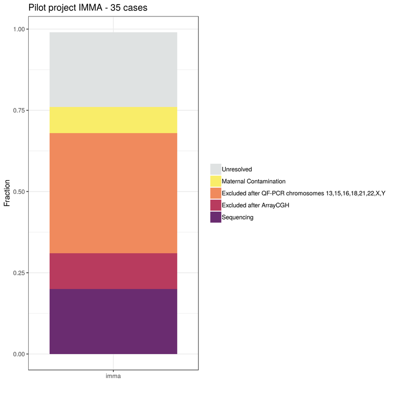

= *Colonna Lab*
:toc-title: Page Content
:toc: left
:toclevels: 4
:imagedir: images/

Welcome to the Population Genomics Laboratory of the http://www.igb.cnr.it/[Institute of Genetics and Biophysics].
We are interested in understanding causes and consequences of genetic diversity and how natural selection in humans affects loci related to diseases

== *Research*

=== Genomics of Recurrent Pregnancy Loss (GReP)

Approximately 70% of all human fertilizations are naturally aborted, with most occurring before the mother knows she is pregnant. Miscarriages that occur later in pregnancy are often due to non-viable genetic variation and this is very likely in the case of Recurrent Pregnancy Losses (RPL).

Numerical and structural chromosomal abnormalities are routinely investigated to understand causes of RPL, while the study of small-size sequence variants that can impact gene function has been neglected, leaving a whole range of possible causes unexplored.

This project will identify variants severely disrupting genes and regulatory functions, therefore incompatible with life, using whole genome sequence of DNA extracted from chorionic villi of miscarriages collected from women with RPL.

 This project will identify variants severely disrupting genes and regulatory functions, therefore incompatible with life, using whole genome sequence of DNA extracted from chorionic villi of miscarriages collected from women with RPL.

We will identify the highly deleterious dominant mutations as well as rare moderately to highly deleterious recessive mutations that constitute the genetic load of human populations and contribute to miscarriage. Participant inclusion criteria (e.g. recurrence, consanguinity, selection of comorbidities) will ensure the prevalence of genetic over environmental causes, and pre-sequencing screening will exclude cases with large chromosomal aberration.

We are interested in sequencing euploid miscarriages, therefore we do a pre-sequencing screening to exclude aneuploidies and comorbidity.

We estimated that 20% of collected samples is euploid. We also find that with current methods it is not possible to make a diagnosis in about 25% of the samples.

This project is in collaboration with:

- https://www.monash.edu.my/science/staff/academic/qasim-ayub[Qasim Ayub], Monash University, Malaysia

- http://docente.unife.it/michele.rubini[Michele Rubini], University of Ferrara

- https://mpba.fbk.eu/furlanello[Cesare Furlanello], Fondazione Bruno Kessler

REPROS is funded by https://www.merigen.it/[Merigen Research s.r.l].

=== Genetics of fruit shape and size in peppers
Capsicum fruits are among the most-widely consumed vegetable crops in the world, and one of the most extensively domesticated plants. While a focus of breeding programs and widely studied for its beneficial properties, the genetics of pepper has been studied mostly by linkage analysis and with the use of coarse sets of markers and low resolution phenotypic data.

We discovered 746k high quality polymorphic sites analyzing sequence data of 373 pepper accessions. We also measured thirty-eight fruit shape and size attributes in 220 C. annuum accessions.We used these data to:

(i) uncover genomic properties of the pepper genome

(ii) describe population structure within the Capsicum genus at a resolution never achieved before

(iii) study natural selection,

(iv) discover significant association between genetic markers and traits related to pepper fruit shape and size in C. annuum, including a non-synonymous change in the sequence of longifolia 1-like gene associated with variance in fruit elongation.

[#img-capsicum]
[caption="Figure 1.2: ",link=https://github.com/GianlucaDamaggio/testWebPage/blob/master/image/preSeq_screaning.png]

Our collection includes 373 pepper accessions from eleven species from 51 countries. It covers all the economically important species of Capsicum widely used in breeding programs, representing the largest study so far in terms of number of species and number of genetic variants analyzed.

This project is a collaboration with Pasquale Tripodi and Nunzio D'Agostino at http://sito.entecra.it/portale/cra_dati_istituto.php?id=207[CREA]

>> See our https://www.biorxiv.org/content/10.1101/487165v2[preprint] on bioRxive!! <<

>> Go to the project https://ezcn.github.io/Capsicum-genomics/[website]! <<

=== Positive selction at the ABCA12 gene

Natural selection acts on genetic variants by increasing the frequency of alleles responsible for a cellular function that is favorable in a certain environment.

In a https://genomebiology.biomedcentral.com/articles/10.1186/gb-2014-15-6-r88[previous genome-wide scan for positive selection] in contemporary humans, we identified a signal of positive selection in European and Asians at the genetic variant rs10180970. The variant is located in the second intron of the http://www.ensembl.org/Homo_sapiens/Gene/Summary?db=core;g=ENSG00000144452;r=2:214931542-215138428[ABCA12] gene, which is implicated in the lipid barrier formation and down-regulated by UVB radiation. Mutations in ABCA12 causes https://omim.org/entry/242500[Harlequin Ichthyosis], a rare recessive disorderd with variable penetrance.

We studied the signal of selection in the genomic region surrounding rs10180970 in a larger dataset that includes DNA sequences from ancient samples. We also investigated the functional consequences of gene expression of the alleles of rs10180970 and another genetic variant in its proximity in healthy volunteers exposed to similar UV radiation.

image::images/abca12.png[abca12,800]

The Cross Population Extended Haplotype Homozogysity statistic (XP-EHH), measured between pairs of continental populations, shows a signal of positive selection in non-Africans over 35kb downstream rs10180970, especially in East-Asians.

>> See our open access https://www.nature.com/articles/s41598-019-40360-9[paper]!! <<

=== Deleterious mutations in human consanguineous populations

Alleles with detrimental consequences and recessive inheritance pattern are the major contributors to the genetic load in human populations. Indeed, while dominant deleterious variants are quickly purged by selection, recessive variants remain in the populations at low frequency and mostly in a heterozygosis.

 In consanguineous populations kin marriages can cause deleterious recessive variants to be exposed in homozygous state causing higher rate rate of disorders (congenital, late onset, infertility, miscarriage, infant mortality and morbidity). At the same time, however, inbreeding provides an occasion for selection to act on deleterious phenotypes, in a phenomenon known as purging through inbreeding.

We are interested in understanding and characterizing the incidence of deleterious mutations in consanguineous populations.

== *People*

=== *Vincenza Colonna*

image:images/vcolonna.jpg[vcolonna,400,role="right"] I am a researcher at the Institue of Genetics and Biophysics of the Italian National Research Council. I graduated in Evolutionary Biology from University of Napoli Federico II (Italy), did postdoctoral work at University of Ferrara (Italy) and at the Wellcome Trust Sanger Institute (UK). I was lectures in Genetics and Bioinformatics at the University of Ferrara (Italy). See my full C.V. http://www.igb.cnr.it/popgenlab/cvenza[here].

I am a population geneticist and an expert in bioinformatics, working mainly with human data.

I led research projects on: analysis of genomic sequences (assembly, variant calling) and genomic inference (functional interpretation of genetic variants);population genetic analyses for inference on demography and natural selection; genetics of isolated populations; evolutionary medicine; genetics of rare genomic variants.

I have actively collaborated on projects involving RNAseq data analysis and general statistical inference. During my undergraduate training, I worked on projects on molecular biology.

I am an experienced trainer in teaching basic lab skills
for research computing (e.g. programming languages, version control, statistical analyses).

I founded and led http://www.igb.cnr.it/obilab[OBiLab], a project on training in Bioinformatics

=== *Silvia Buonaiuto*, PhD student

image:images/silvia.jpg[silvia,200,role="right"] I am a Phd Student at National Research Council and Università della Campania Luigi Vanvitelli. I work on a project that studies idiopathic recurrent miscarriage and aims at identifying genetic variants likely to cause miscarriages to ultimately improve prenatal diagnosis.

I have a master’s degree in Biology from the University of Napoli Federico II. I did a master thesis in molecular biology at the Department of Biology.

=== *Gianluca Damaggio*, Master Student

image:images/gianluca.jpg[gianluca,200,role="right"] I received a bachelor's degree in Molecular Biology at the University of Napoli Federico II (Italy) and now I am a master's student at the Institue of Genetics and Biophysics of the Italian National Research Council.

My project consists in the analysis of  embryonic whole-genome sequences from recurrent miscarriages in humans. My interest is to investigate the enrichment of deleterious consequences in our cases compared to a control population. To do this I study the distribution of deleterious variants in the Allele Frequency Spectrum.

I am also collaborating to project with the Laboratory of Elena Cattaneo in Milano. My contribution is to set up a pipeline to count the number of repeats in the Huntington's gene.

=== *Flavia Villani*, Master Student

I am a master's student at the Institue of Genetics and Biophysics of the Italian National Research Council. I graduated in Biology at the University of Fisciano (Italy).

I contributed to a project that studies idiopathic recurrent miscarriage. Currently, I am working to build a library using the Python programming language for the statistical analysis of negative selection using sequence data. In particular, I am focusing on the use of pangenomic sequence data.

=== *Giuliana D'angelo*, Master Student

I am a molecular biology student at University of Naples Federico II currently working on my master's degree thesis at the Institue of Genetics and Biophysics of the Italian National Research Council.

For my thesis, I am studying embryonic mitochondrial sequences from recurrent miscarriages in humans. In particular, I am doing the variant calling, determining haplogroups, and studying the incidence of deleterious mutations in mitochondrial genes and regulatory regions.

=== Former members

* Roberto Sirica, PhD student, 2015-2018
* Gaia Leandra Cecere, undergraduate student, 2018
* Marianna Buonaiuto, visiting Postdoc, 2017
* Lucia De Martino, visiting Graduate Student, 2016

== *Publications*

See them on https://scholar.google.it/citations?user=ufP1EYgAAAAJ&hl=en&oi=ao[Google Scholar] or in http://publicationslist.org/vincenza.colonna[Publication]

Peer-reviewed Journals

1. Anagnostou P, Dominici V, Battaggia C, Lisi A, Sarno S, Boattini A, Calò C, Francalacci P, Vona G, Tofanelli S, Vilar MG, Colonna V, Pagani L, Destro Bisol G. Inter-individual genomic heterogeneity within European population isolates. PLoS One. 2019 Oct 9;14(10):e0214564. doi: 10.1371/journal.pone.0214564. eCollection 2019. PubMed PMID: 31596857

2. Colonna V, D'Agostino N, Garrison E, Albrechtsen A, Jonas Meisner J, Facchiano A, Cardi T, Tripodi P Genomic diversity and novel genome-wide association with fruit morphology in Capsicum, from 746k polymorphic sites. Sci Rep. 2019 Jul 11;9(1):10067. doi: 10.1038/s41598-019-46136-5. PubMed PMID: 31296904

3. Petrella V, Aceto S, Colonna V, Saccone G, Sanges R, Polanska N, Volf P, Gradoni L, Bongiorno G, Salvemini M Identification of sex determination genes and their evolution in Phlebotominae sand flies (Diptera, Nematocera) . BMC Genomics 2019 in press

4. Sirica R, Buonaiuto M, Petrella V, Sticco L, Tramontano D, Antonini D, Missero C, Guardiola O, Andolfi G, Kumar H, Ayub Q, Xue Y, Tyler-Smith C, Salvemini M, D'Angelo G, Colonna V. Positive selection in Europeans and East-Asians at the ABCA12 gene. Sci Rep. 2019 Mar 19;9(1):4843. doi: 10.1038/s41598-019-40360-9. PubMed PMID: 30890716

5. Gardner EJ, Lam VK, Harris DN, Chuang NT, Scott EC, Pittard WS, Mills RE; 1000 Genomes Project Consortium, Devine SE. The Mobile Element Locator Tool (MELT): population-scale mobile element discovery and biology. Genome Res. 2017 Nov;27(11):1916-1929. doi: 10.1101/gr.218032.116. Epub 2017 Aug 30. PubMed PMID: 28855259

6. Xue Y, Mezzavilla M, Haber M, McCarthy S, Chen Y, Narasimhan V, Gilly A, Ayub Q, Colonna V, Southam L, Finan C, Massaia A, Chheda H, Palta P, Ritchie G, Asimit J, Dedoussis G, Gasparini P, Palotie A, Ripatti S, Soranzo N, Toniolo D, Wilson JF, Durbin R, Tyler-Smith C, Zeggini E. Enrichment of low-frequency functional variants revealed by whole-genome sequencing of multiple isolated European populations. Nat Commun. 2017 Jun 23;8:15927. doi: 10.1038/ncomms15927. PubMed PMID: 28643794

7. Pagani L, Colonna V, Tyler-Smith C, Ayub Q. An Ethnolinguistic and Genetic Perspective on the Origins of the Dravidian-Speaking Brahui in Pakistan. Man India. 2017;97(1):267-278. PubMed PMID: 28381901

8. Anagnostou P, Dominici V, Battaggia C, Pagani L, Vilar M, Wells RS, Pettener D, Sarno S, Boattini A, Francalacci P, Colonna V, Vona G, Calò C, Destro Bisol G, Tofanelli S. Overcoming the dichotomy between open and isolated populations using
genomic data from a large European dataset. Sci Rep. 2017 Feb 1;7:41614. doi:10.1038/srep41614. PubMed PMID: 28145502

9. Terreri S, Durso M, Colonna V, Romanelli A, Terracciano D, Ferro M, Perdonà S, Castaldo L, Febbraio F, de Nigris F, Cimmino A. New Cross-Talk Layer between Ultraconserved Non-Coding RNAs, MicroRNAs and Polycomb Protein YY1 in Bladder Cancer. Genes (Basel). 2016 Dec 14;7(12). pii: E127. PubMed PMID: 27983635

10. Lania G, Bresciani A, Bisbocci M, Francone A, Colonna V, Altamura S, Baldini A. Vitamin B12 ameliorates the phenotype of a mouse model of DiGeorge syndrome. Hum Mol Genet. 2016 Aug 9. pii: ddw267.PubMed PMID: 27506981

11. McKerrell T, Moreno T, Ponstingl H, Bolli N, Dias JM, Tischler G, Colonna V, Manasse B, Bench A, Bloxham D, Herman B, Fletcher D, Park N, Quail MA, Manes N, Hodkinson C, Baxter J, Sierra J, Foukaneli T, Warren AJ, Chi J, Costeas P, Rad R, Huntly B, Grove C, Ning Z, Tyler-Smith C, Varela I, Scott M, Nomdedeu J, Mustonen V, Vassiliou GS. Development and validation of a comprehensive genomic diagnostic tool for myeloid malignancies. Blood 2016 Apr 27. pii: blood-2015-11-683334. PubMed PMID: 27121471

12. Olivieri M, Ferro M, Terreri S, Durso M, Romanelli A, Avitabile C, De Cobelli O, Messere A, Bruzzese D, Vannini I, Marinelli L, Novellino E, Zhang W, Incoronato M, Ilardi G, Staibano S, Marra L, Franco R, Perdonà S, Terracciano D, Czerniak B, Liguori GL, Colonna V, Fabbri M, Febbraio F, Calin GA, Cimmino A. Long non-coding RNA containing ultraconserved genomic region 8 promotes bladder cancer tumorigenesis. Oncotarget. 2016 Mar 1. PubMed PMID: 26943042

13. Petrella V, Aceto S, Musacchia F, Colonna V, Robinson M, Benes V, Cicotti G, Bongiorno G, Gradoni L, Volf P, Salvemini M. De novo assembly and sex-specific transcriptome profiling in the sand fly Phlebotomus perniciosus (Diptera, Phlebotominae), a major Old World vector of Leishmania infantum. BMC Genomics. 2015 Oct 23;16(1):847. PubMed PMID: 26493315

14. 1000 Genomes Project Consortium, Auton A, Brooks LD, Durbin RM, Garrison EP, Kang HM, Korbel JO, Marchini JL, McCarthy S, McVean GA, Abecasis GR. A global reference for human genetic variation. Nature. 2015 Oct 1;526(7571):68-74. PubMed PMID: 26432245

15. Shah SS, Mohyuddin A, Colonna V, Mehdi SQ, Ayub Q. Monoamine Oxidase A gene polymorphisms and self reported aggressive behaviour in a Pakistani ethnic group. J Pak Med Assoc. 2015 Aug;65(8):818-24. PubMed PMID: 26228323

16. Delaneau O, Marchini J; 1000 Genomes Project Consortium; 1000 Genomes Project Consortium. Integrating sequence and array data to create an improved 1000 Genomes Project haplotype reference panel. Nat Commun. 2014 Jun 13;5:3934. doi: 10.1038/ncomms4934. PubMed PMID: 25653097

17. Mezzavilla M, Vozzi D, Pirastu N, Girotto G, d'Adamo P, Gasparini P, Colonna V. Genetic landscape of populations along the Silk Road: admixture and migration patterns. BMC Genet. 2014 Dec 5;15:131. PubMed PMID: 25476266

18. Panoutsopoulou K, Hatzikotoulas K, Xifara DK, Colonna V, Farmaki AE, Ritchie GR, Southam L, Gilly A, Tachmazidou I, Fatumo S, Matchan A, Rayner NW, Ntalla I, Mezzavilla M, Chen Y, Kiagiadaki C, Zengini E, Mamakou V, Athanasiadis A, Giannakopoulou M, Kariakli VE, Nsubuga RN, Karabarinde A, Sandhu M, McVean G, Tyler-Smith C, Tsafantakis E, Karaleftheri M, Xue Y, Dedoussis G, Zeggini E. Genetic characterization of Greek population isolates reveals strong genetic drift at missense and trait-associated variants. Nat Commun. 2014 Nov 6;5:5345. doi: 10.1038/ncomms6345. PubMed PMID: 25373335

19. Colonna V, Ayub Q, Chen Y, Pagani L, Luisi P, Pybus M, Garrison E, Xue Y, Tyler-Smith C; 1000 Genomes Project Consortium, Abecasis GR, Auton A, Brooks LD, DePristo MA, Durbin RM, Handsaker RE, Kang HM, Marth GT, McVean GA. Human genomic regions with exceptionally high levels of population differentiation identified from 911 whole-genome sequences. Genome Biol. 2014 Jun 30;15(6):R88. doi: 10.1186/gb-2014-15-6-r88. PubMed PMID: 24980144

20. Ayub Q, Moutsianas L, Chen Y, Panoutsopoulou K, Colonna V, Pagani L, Prokopenko I, Ritchie GR, Tyler-Smith C, McCarthy MI, Zeggini E, Xue Y. Revisiting the thrifty gene hypothesis via 65 loci associated with susceptibility to type 2 diabetes. Am J Hum Genet. 2014 Feb 6;94(2):176-85. doi: 10.1016/j.ajhg.2013.12.010. Epub 2014 Jan 9. PubMed PMID: 24412096

21. Sikora MJ, Colonna V, Xue Y, Tyler-Smith C. Modeling the contrasting Neolithic male lineage expansions in Europe and Africa. Investig Genet. 2013 Nov 21;4(1):25. doi: 10.1186/2041-2223-4-25. PubMed PMID: 24262073

22. Khurana E*, Fu Y*, Colonna V*, Mu XJ*, Kang HM, Lappalainen T, Sboner A, Lochovsky L, Chen J, Harmanci A, Das J, Abyzov A, Balasubramanian S, Beal K, Chakravarty D, Challis D, Chen Y, Clarke D, Clarke L, Cunningham F, Evani US, Flicek P, Fragoza R, Garrison E, Gibbs R, Gümüs ZH, Herrero J, Kitabayashi N, Kong Y, Lage K, Liluashvili V, Lipkin SM, MacArthur DG, Marth G, Muzny D, Pers TH, Ritchie GR, Rosenfeld JA, Sisu C, Wei X, Wilson M, Xue Y, Yu F; 1000 Genomes Project Consortium, Dermitzakis ET, Yu H, Rubin MA, Tyler-Smith C, Gerstein M. Integrative annotation of variants from 1092 humans: application to cancer genomics. Science. 2013 Oct 4;342(6154):1235587. doi: 10.1126/science.1235587. PubMed PMID: 24092746
*equal contribution

23. Ghirotto S, Tassi F, Fumagalli E, Colonna V, Sandionigi A, Lari M, Vai S, Petiti E, Corti G, Rizzi E, De Bellis G, Caramelli D, Barbujani G. Origins and evolution of the Etruscans' mtDNA. PLoS One. 2013;8(2):e55519. PubMed PMID: 23405165

24. 1000 Genomes Project Consortium, Abecasis GR, Auton A, Brooks LD, DePristo MA, Durbin RM, Handsaker RE, Kang HM, Marth GT, McVean GA. An integrated map of genetic variation from 1,092 human genomes. Nature. 2012 Nov 1;491(7422):56-65. PubMed PMID: 23128226

25. Boraska V, Jerončić A, Colonna V, Southam L, Nyholt DR, Rayner NW, Perry JR, Toniolo D, Albrecht E, Ang W, Bandinelli S, Barbalic M, Barroso I, Beckmann JS, Biffar R, Boomsma D, Campbell H, Corre T, Erdmann J, Esko T, Fischer K, Franceschini N, Frayling TM, Girotto G, Gonzalez JR, Harris TB, Heath AC, Heid IM, Hoffmann W, Hofman A, Horikoshi M, Zhao JH, Jackson AU, Hottenga JJ, Jula A, Kähönen M, Khaw KT, Kiemeney LA, Klopp N, Kutalik Z, Lagou V, Launer LJ, Lehtimäki T, Lemire M, Lokki ML, Loley C, Luan J, Mangino M, Mateo Leach I, Medland SE, Mihailov E, Montgomery GW, Navis G, Newnham J, Nieminen MS, Palotie A, Panoutsopoulou K, Peters A, Pirastu N, Polasek O, Rehnström K, Ripatti S, Ritchie GR, Rivadeneira F, Robino A, Samani NJ, Shin SY, Sinisalo J, Smit JH, Soranzo N, Stolk L, Swinkels DW, Tanaka T, Teumer A, Tönjes A, Traglia M, Tuomilehto J, Valsesia A, van Gilst WH, van Meurs JB, Smith AV, Viikari J, Vink JM, Waeber G, Warrington NM, Widen E, Willemsen G, Wright AF, Zanke BW, Zgaga L; Wellcome Trust Case Control Consortium, Boehnke M, d'Adamo AP, de Geus E, Demerath EW, den Heijer M, Eriksson JG, Ferrucci L, Gieger C, Gudnason V, Hayward C, Hengstenberg C, Hudson TJ, Järvelin MR, Kogevinas M, Loos RJ, Martin NG, Metspalu A, Pennell CE, Penninx BW, Perola M, Raitakari O, Salomaa V, Schreiber S, Schunkert H, Spector TD, Stumvoll M, Uitterlinden AG, Ulivi S, van der Harst P, Vollenweider P, Völzke H, Wareham NJ, Wichmann HE, Wilson JF, Rudan I, Xue Y, Zeggini E. Genome-wide meta-analysis of common variant differences between men and women. Hum Mol Genet. 2012 Nov 1;21(21):4805-15. PubMed PMID: 22843499

26. Colonna V, Pistis G, Bomba L, Mona S, Matullo G, Boano R, Sala C, Viganò F, Torroni A, Achilli A, Hooshiar Kashani B, Malerba G, Gambaro G, Soranzo N, Toniolo D. Small effective population size and genetic homogeneity in the Val Borbera isolate. Eur J Hum Genet. 2013 Jan;21(1):89-94. PubMed PMID: 22713810

27. Everitt AR, Clare S, Pertel T, John SP, Wash RS, Smith SE, Chin CR, Feeley EM, Sims JS, Adams DJ, Wise HM, Kane L, Goulding D, Digard P, Anttila V, Baillie JK, Walsh TS, Hume DA, Palotie A, Xue Y, Colonna V, Tyler-Smith C, Dunning J, Gordon SB; GenISIS Investigators; MOSAIC Investigators, Smyth RL, Openshaw PJ, Dougan G, Brass AL, Kellam P. IFITM3 restricts the morbidity and mortality associated with influenza. Nature. 2012 Mar 25;484(7395):519-23. PubMed PMID: 22446628

28. Colonna V, Pagani L, Xue Y, Tyler-Smith C. A world in a grain of sand: human history from genetic data. Genome Biol. 2011 Nov 21;12(11):234. PubMed PMID: 22104725

29. Kutanan W, Kampuansai J, Colonna V, Nakbunlung S, Lertvicha P, Seielstad M, Bertorelle G, Kangwanpong D. Genetic affinity and admixture of northern Thai people along their migration route in northern Thailand: evidence from autosomal STR loci. J Hum Genet. 2011 Feb;56(2):130-7. PubMed PMID: 21107341

30. Colonna V, Boattini A, Guardiano C, Dall'ara I, Pettener D, Longobardi G, Barbujani G. Long-range comparison between genes and languages based on syntactic distances. Hum Hered. 2010;70(4):245-54. PubMed PMID: 20948220

31. Barbujani G, Colonna V. Human genome diversity: frequently asked questions. Trends Genet. 2010 Jul;26(7):285-95. PubMed PMID: 20471132

32. Bronberg RA, Dipierri JE, Alfaro EL, Barrai I, Rodríguez-Larralde A, Castilla EE, Colonna V, Rodríguez-Arroyo G, Bailliet G. Isonymy structure of Buenos Aires city. Hum Biol. 2009 Aug;81(4):447-61. PubMed PMID: 20067369

33. Colonna V, Nutile T, Ferrucci RR, Fardella G, Aversano M, Barbujani G, Ciullo M. Comparing population structure as inferred from genealogical versus genetic information. Eur J Hum Genet. 2009 Dec;17(12):1635-41.PubMed PMID: 19550436

34. Belle EM, Benazzo A, Ghirotto S, Colonna V, Barbujani G. Comparing models on the genealogical relationships among Neandertal, Cro-Magnoid and modern Europeans by serial coalescent simulations. Heredity (Edinb). 2009 Mar;102(3):218-25. PubMed PMID: 18971954

35. Ciullo M, Nutile T, Dalmasso C, Sorice R, Bellenguez C, Colonna V, Persico MG, Bourgain C. Identification and replication of a novel obesity locus on chromosome 1q24 in isolated populations of Cilento. Diabetes. 2008 Mar;57(3):783-90. PubMed PMID:

36. Colonna V, Nutile T, Astore M, Guardiola O, Antoniol G, Ciullo M, Persico MG. Campora: a young genetic isolate in South Italy. Hum Hered. 2007;64(2):123-35. PubMed PMID: 17476112

37. Ciullo M, Bellenguez C, Colonna V, Nutile T, Calabria A, Pacente R, Iovino G, Trimarco B, Bourgain C, Persico MG. New susceptibility locus for hypertension on chromosome 8q by efficient pedigree-breaking in an Italian isolate. Hum Mol Genet. 2006 May 15;15(10):1735-43. PubMed PMID: 16611673

38. Tarsitano M, De Falco S, Colonna V, McGhee JD, Persico MG. The C. elegans pvf-1 gene encodes a PDGF/VEGF-like factor able to bind mammalian VEGF receptors and to induce angiogenesis. FASEB J. 2006 Feb;20(2):227-33. PubMed PMID: 16449794

Book chapters

* 2011 Barbujani G., Colonna V. (2011). Genetic bases of human biodiversity: an update. . In: Zachos F.E., Habel J.C. . Biodiversity Hotspots . p. 97-120, berlino:springer, ISBN: 9783642209918
* 2010 BARBUJANI G, COLONNA V (2010). Genetic bases of human biodiversity: an update. In: ZACHOS F. BIODIVERSITY HOTSPOTS. BERLIN:Springer

== *Contacts*

Vincenza Colonna, PhD

Istituto di Genetica e Biofisica "Adriano Buzzati-Traverso"
piano R, stanza 11
via Pietro Castellino 111 - 80131 Napoli - Italy - https://www.google.co.uk/maps/place/Cnr+Consiglio+Nazionale+Delle+Ricerche/@40.8545777,14.2250388,17z/data=!4m6!1m3!3m2!1s0x133b08ed1ffff6c1:0xede26e8ccb5ccb3b!2sCnr+Consiglio+Nazionale+Delle+Ricerche!3m1!1s0x133b08ed1ffff6c1:0xede26e8ccb5ccb3b[map]

tel. +39 081 6132 254

Email: vincenza.colonna@igb.cnr.it
