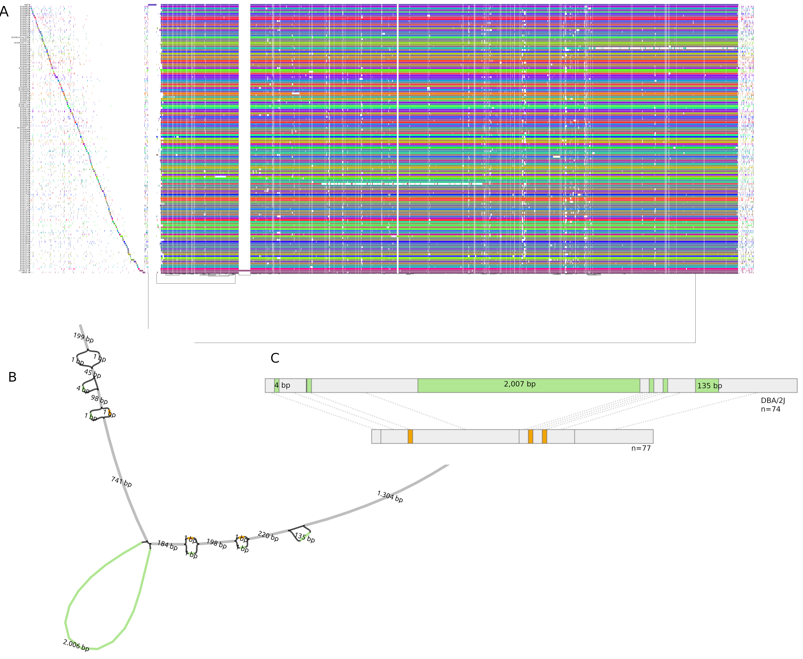
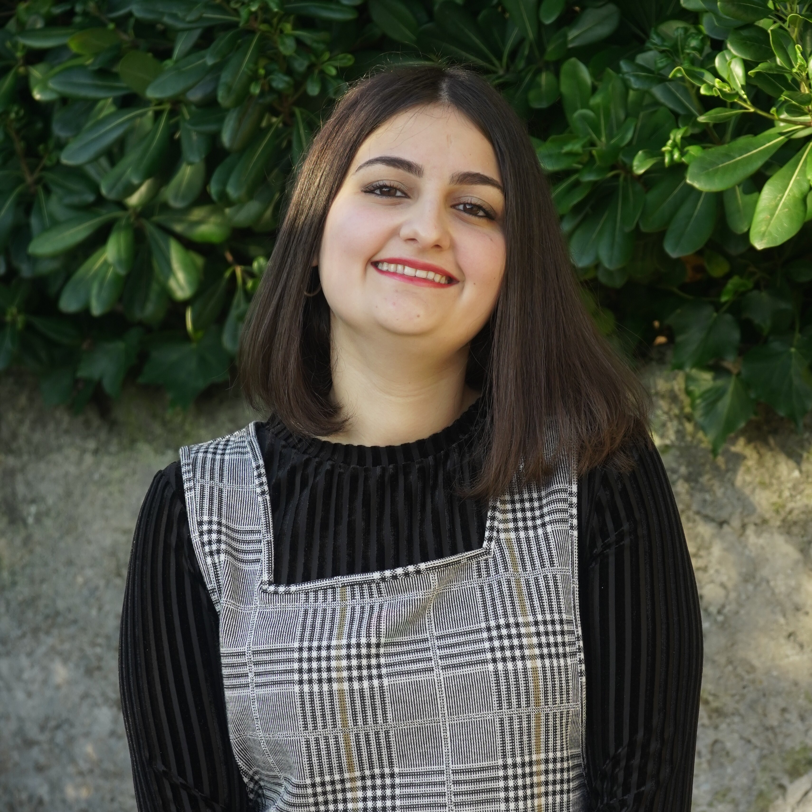

= *Colonna Lab*
:figure-caption!:
:toc-title: Page Content
:toc: left
:toclevels: 2
:hide-uri-scheme: 
:hardbreaks-option:

Welcome to the *Population Genomics Laboratory* of the https://www.igb.cnr.it/[Institute of Genetics and Biophysics] of the https://www.cnr.it/en[National Research Council]. We are interested in understanding causes and consequences of genetic diversity and how natural selection in humans affects loci related to diseases.

[quote]
"_Fascinating_" _(Lieutenant Spock)_

== *Research*

=== *Genomics of early embryonic development* 

_How natural selection acts on early human development_

We investigate adverse outcomes of embryonic development like recurrent pregnancy loss and preeclampsia to identify the genetic factors that influence reproductive outcomes and pregnancy complications. This knowledge furthers our understanding of human evolution and informs efforts to improve pregnancy outcomes.

image::images/embryo.png[embryo,1000,500]

In *CABERNET* we aim to determine the extent of chromosomal mosaicism between embryonic and extraembryonic tissues using single cell DNA sequencing.
In *DELIVER / NEONATE* we want to identify genetic factors contributing to reproductive failure and recurrent miscarriage. We will use single cell strand sequencing to map balanced rearrangements and whole genome sequencing of euploid miscarried embryos to identify causative variants.
In *CANDLE* we want to uncover gene expression patterns associated with _APOL1_ risk alleles and preeclampsia in African American women. We will examine the role of ancestry in mediating the relationship between _APOL1_ genotype and preeclampsia risk. The results can provide insights into genetic and molecular basis of preeclampsia.

.This project is in collaboration with 
* https://scholar.google.at/citations?user=ceRslzAAAAAJ&hl=en[Francesca Antonacci] University of Bari Aldo Moro
* https://scholar.google.at/citations?user=02eKUFwAAAAJ&hl=en&oi=ao[Carlo Alviggi], University of Naples Federico II 
* https://scholar.google.at/citations?user=iukICNwAAAAJ&hl=en&oi=ao[Antonio Lamarca], University of Modena and Reggio Emilia
* Marcella Vacca, National Research Council
* https://scholar.google.at/citations?user=L1PKDnYAAAAJ&hl=en&oi=ao[Gabriella Lania], National Research Council
* https://www.merigen.it/[Imma and Sebastiano Di Biase], MeriGen Research, Italy
* Antonio Capalbo, Juno Genomics  
* http://docente.unife.it/michele.rubini[Michele Rubini] University of Ferrara 
* https://www.monash.edu.my/science/staff/academic/qasim-ayub[Qasim Ayub], Monash University, Malaysia

==== *Funding*
- PRIN 2020J84FAM Ministero dell'Universita e della Ricerca 
- PRIN 2022WEHP7M Ministero dell'Universita e della Ricerca 
- PRIN P2022ZE75A Ministero dell'Universita e della Ricerca 
- https://www.merigen.it/[Merigen Research s.r.l] 
- POR Campania FSE 2014-2020 ASSE III – Ob. Sp. 14 

image::images/loghi_grep.png[loghi_grep,400,align="left"]
image::images/miur.jpg[miur,400,align="left"]

'''
=== Admixture Mapping and Pangenomics Analysis in the Biorepository and Integrative Genomics (BIG) Initiative Cohort

_Improving Phenotype-Genotype Linkages through Ancestry Patterns_

The BIG initiative is currently recruiting 30k participants from Memphis (TN), mostly children, with plans to include a total of 100,000 samples over the next five years. Nearly 45% of current participants are of African ancestry, and the cohort is partnering with the Genomic Information Commons, a consortium of top children's hospitals, to conduct genomics research aimed at discovering the genetic foundations of human disease in diverse populations. 

We want to understand the extent and origin of admixture patterns in the Biorepository and Integrative Genomics (BIG) Initiative cohort and to develop pipelines for admixture mapping of phenotypic traits related to diseases and natural selection phenotypes.

We are using existing exome sequence data and electronic health records from 10k children to obtain an improved set of genetic variants, including structural variants through mapping against reference pangenomes and imputation. 
We will reconstruct the demographic history of the individuals in the cohort at individual and population levels, determine the identity of the ancestral populations and deconvolute their contribution to the genome of single individuals. The ancestry information will be used to identify patterns of natural selection and map phenotypic traits.

.This project is in collaboration with 
* https://scholar.google.com/citations?user=OYJMYwIAAAAJ&hl=en[Robert Williams], 
* https://scholar.google.com/citations?user=965VipkAAAAJ[Robert Davis],
* https://scholar.google.com/citations?user=DuzpZDEAAAAJ[Akram Mohammed]

'''
=== Mouse Pangenomics 

Mice members of BXDs family have been inbred for 20-200 generations. They are of great value for mapping complex traits and phenome-wide association analyses. Current genomic studies on BXD assume a single linear reference genome, making it difficult to observe sequences diverging from the reference, therefore limiting the accuracy and completeness of analyses. Pangenome models overcome this limitation as they contain the full genomic information of a species.

We are building a reference pangenome for all extant members of all BXD families leveraging third generation and 10X sequence data. We will analyze the genetic variation in relation to thousands of phenotypes in the https://genenetwork.org/ database. 

.[purple]#_(A) odgi-vizlinear visualization of the pangenome of chromosome 19. Each line represents a haplotype. Line interruptions (white) are insertions in one or more strains, therefore deletions in the others (vertical white stripes). The left side is the centromere, the right side is the telomere.In these two regions sequences are fragmented. (B) Extract of the pangenome from the Zfp91gene showing a 2,006 bp insertion found in DBA/2J and 48% of the BXD strains(green nodes in the graph). The insertion is in complete linkage with two other insertions of 4 bp and 135 bp in a region spanning 2.8 kbp. (C) Strain-specific haplotypes (gray segments are not in scale)_#

.This project is in collaboration with the Department of Genetics, Genomics and Informatics, University of Tennessee Health Science Center,Memphis, TN
* https://scholar.google.com/citations?user=OYJMYwIAAAAJ&hl=en[Robert Williams]
* https://davidashbrook.wordpress.com/[David Ashbrook]
* https://thebird.nl/[Pjotr Prins]
* http://www.hypervolu.me/~erik/erik_garrison.html[Erik Garrison] 

*Our biorxiv preprint on this project can be find https://www.biorxiv.org/content/10.1101/2022.04.21.489063v1.full[here] and https://www.biorxiv.org/content/10.1101/2022.03.02.482700v1.full[here]*

Our contribution to pangenomics ... 

'''

//== *Training in Bioinformatics*

//We are actively organizing and participating into bioinformatics training

//== *Science communication*

== *People*

=== *Vincenza Colonna*

.[purple]#_I am a researcher at the Institue of Genetics and Biophysics of the Italian National Research Council. I graduated in Evolutionary Biology from University of Napoli Federico II (Italy), did postdoctoral work at University of Ferrara (Italy) and at the Wellcome Trust Sanger Institute (UK). I was lectures in Genetics and Bioinformatics at the University of Ferrara (Italy)._#
image:images/vcolonna.jpg[vcolonna,200,role="right"]

I am a genomicist and an expert in human evolutionary and population genomics and bioinformatics. 

I graduated in Evolutionary Biology from the University of Naples Federico II and did postdoctoral research at the University of Ferrara (Italy) and at Wellcome Trust Sanger Institute in Cambridge (UK). I am now leading the Population genomics laboratory  at the IGB-CNR (Naples, Italy) and I am Assistant Professor at the University of Tennessee, College of Medicine, in the Department of Genetics, Genomics and Informatics 

In my postdoctoral research I was part of the international consortium 1000 Genomes[PMID: 26432245; 23128226] where I led contributions to two specific aspects. First, I contributed to develop FunSeq [PMID: 24092746], a tool that integrates non-coding information from relevant biological databases for the functional characterization of non-coding variants. Second, I lead a genome-wide scan to identify genomic regions with exceptionally high levels of population differentiation [PMID: 24980144] demonstrating that these regions are enriched for positive selection events and that one half may be the result of classic selective sweeps. Findings from both sub-projects have since been applied to demographic inference and the molecular diagnosis of cancer and myeloid malignancies [PMID: 27121471, 22446628], and to deeper studies on positive selection at the ABCA12 gene [PMID: 30890716]. 

During my PhD I worked on human isolated populations contributing to characterize several isolated populations, describing the genomic consequences of isolation [PMID: 17476112, 19550436, 22713810], contributing to genetic association studies [PMID: 16611673, 18162505] and to characterize rare variation [PMID: 28643794]

//+ [gray]#See my full C.V. https://github.com/ColonnaLab/laboratory_WebPage/tree/master/docs/CV_EnzaColonna.pdf[here].#

I founded and led http://www.igb.cnr.it/obilab[OBiLab], a project on training in Bioinformatics

image:images/Octicons-mark-github.svg[git,30] https://github.com/ezcn[My GitHub]

https://scholar.google.com/citations?user=ufP1EYgAAAAJ&hl=en&oi=ao[Google Scholar]

'''

=== *Silvia Buonaiuto*, Postdoctoral fellow

image:images/silvia.jpg[silvia,200,role="right"] 

.[purple]#_I have a PhD degree From the university Luigi Vanvitelli, a master’s degree in Biology from the University of Napoli Federico II. I did a master thesis in molecular biology at the Department of Biology._#

I work on project *DELIVER Decipher unExpLored genetIc Variation inrEproductive failuRe*. My project studies idiopathic recurrent miscarriage to identify genetic variants likely to be causative and ultimately improve prenatal diagnosis.

image:images/Octicons-mark-github.svg[git,30] https://github.com/SilviaBuonaiuto[My GitHub]

https://scholar.google.com/citations?user=oGGUawcAAAAJ&hl=it&oi=ao[Google Scholar]

'''

'''
=== *Franco Marsico*, Postdoctoral fellow

image:images/franco.jpeg[franco,200,role="right"] 

.[purple]#_I earned my degree in Biology from the University of Buenos Aires, Argentina, where I also completed my PhD in Computational Biology at the Calculus Institute. My research primarily focused on developing mathematical models for kinship inference, employing a Bayesian Approach. I am a postdoc in the Colonna lab, where my work centers on population genomics._#

I am currently working on *Admixture Mapping and Pangenomics Analysis in the Biorepository and Integrative Genomics (BIG) Initiative Cohort* project. My focus is on studying recent natural selection signals in admixed populations. Additionally, I have a deep interest in evolution and how to compute processes that shape the history of life. 

image:images/Octicons-mark-github.svg[git,30] https://github.com/MarsicoFL[Github profile]

https://scholar.google.ca/citations?user=Vd4yh9wAAAAJ&hl=en[Google Scholar]

'''

=== *Gianluca Damaggio*, Postdoctoral fellow

image:images/gianluca.jpg[gianluca,200,role="right"]  

.[purple]#_I have just completed my Ph.D. in Biology at the University of Napoli Federico II and obtained a master’s degree in Molecular Biology from the same university._#

My project, *HD-DittoGraph - a digital human Embryonic Stem Cell platform for Hungtinton’s repeats*, aims to develop the capability to accurately detect perturbations in short tandem repeats of the Huntington’s gene within proliferative cells, utilizing third-generation sequencing data. Throughout my Ph.D., I have also gained expertise in analyzing data from single-cell RNA-seq and ATAC-seq. Currently, I am a visiting student at the IGB-CNR in Naples and a Junior Research Fellow at the University of Milano Statale in Elena Cattaneo's Laboratory.

image:images/Octicons-mark-github.svg[git,30] https://github.com/GianlucaDamaggio[My GitHub]

https://scholar.google.se/citations?user=23D5l4cAAAAJ&hl=it[Google Scholar]

'''
=== *Flavia Villani*, PhD Student

 

.[purple]#_I obtained a Master's degree in Medical Biotechnology from the University of Naples Federico II in Italy. Currently, I am a PhD candidate at the University of Tennessee Health Science Center in the Colonna lab._#

I am working on the *Mouse Pangenomics* Project. My research aims to construct the pangenome graph of model organisms, specifically inbred mice and rats, using a combination of short and long-read sequence data. This will enable genome-wide association studies to be performed directly on the pangenome. Additionally, I have a strong interest in understanding how mobile genetic elements have driven genome evolution through various mechanisms.

image:images/Octicons-mark-github.svg[git,30] https://github.com/Flavia95[My GitHub]

https://scholar.google.com/citations?user=CrklVWcAAAAJ&hl=en[Google Scholar]

'''

=== *Rosanna Maione* , Research Associate 

 

.[purple]#_I have a master degree in Medical Biotechnology from the University of Naples Federico II and a master  in Embryology. I am an expert in embryology and assisted human reproduction._#

I am in charge of recruitment, sample collection and processing for the projects  related to the genomics of early embryonic development. I am responsible for building the DNA and tissue collection.  

'''

== *Former members*
* Madeleine Emms, Postdoctoral fellow, 2022-2023
* Marialaura Zitiello, Master Student, 2022-2023
* Antonella Mecca, Master Student, 2022-2023
* Angela Sequino, Master Student, 2022-2023
* Davide D'angelo, Visiting master student, 2022 
* Giuliana D'Angelo, Master Student, 2019-2020
* Roberto Sirica, PhD student, 2015-2018
* Gaia Leandra Cecere, undergraduate student, 2018
* Marianna Buonaiuto, visiting Postdoc, 2017
* Lucia De Martino, visiting master Student, 2016

== *Publications*

See them on https://scholar.google.it/citations?user=ufP1EYgAAAAJ&hl=en&oi=ao[Google Scholar] 

=== *Past Research*

At this https://github.com/ColonnaLab/laboratory_WebPage/blob/master/docs/pastResearc.adoc[link] is possible to found our past Research

== *Contacts*

Vincenza Colonna, PhD

Istituto di Genetica e Biofisica "Adriano Buzzati-Traverso"
piano R, stanza 11
via Pietro Castellino 111 - 80131 Napoli - Italy - https://www.google.co.uk/maps/place/Cnr+Consiglio+Nazionale+Delle+Ricerche/@40.8545777,14.2250388,17z/data=!4m6!1m3!3m2!1s0x133b08ed1ffff6c1:0xede26e8ccb5ccb3b!2sCnr+Consiglio+Nazionale+Delle+Ricerche!3m1!1s0x133b08ed1ffff6c1:0xede26e8ccb5ccb3b[map]

Email: enza.colonna@gmail.com  - vcolonna@uthsc.eud - vincenza.colonna@igb.cnr.it
