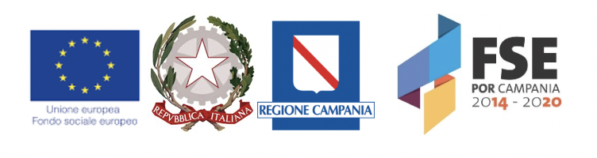

= *Colonna Lab*
:figure-caption!:
:toc-title: Page Content
:toc: left
:toclevels: 2

:hardbreaks-option:
Welcome to the *Population Genomics Laboratory* of the http://www.igb.cnr.it/[Institute of Genetics and Biophysics] of the https://www.cnr.it/en[National Research Council].
We are interested in understanding causes and consequences of genetic diversity and how natural selection in humans affects loci related to diseases. 

:center
"_Fascinating_" _(Lieutenant Spock)_

image::images/loghi_cnr_igb.png[400]

== *Research*

'''
=== *Genomics of early embryonic development* 
:hardbreaks-option:

[.lead]
Our research aims to uncover how natural selection acts on early human development. We investigate adverse outcomes of embryonic development like recurrent pregnancy loss and preeclampsia to identify the genetic factors that influence reproductive outcomes and pregnancy complications. 
This knowledge furthers our understanding of human evolution and informs efforts to improve pregnancy outcomes.

image::images/embryo.png[embryo,1000,500]

[.lead]
In _CABERNET_ we aim to determine the extent of chromosomal mosaicism between embryonic and extraembryonic tissues using single cell DNA sequencing.
In _DELIVER / NEONATE_ we want to identify genetic factors contributing to reproductive failure and recurrent miscarriage. We will use single cell strand sequencing to map balanced rearrangements and whole genome sequencing of euploid miscarried embryos to identify causative variants.
In _CANDLE_ we want to uncover gene expression patterns associated with _APOL1_ risk alleles and preeclampsia in African American women. We will examine the role of ancestry in mediating the relationship between _APOL1_ genotype and preeclampsia risk. The results can provide insights into genetic and molecular basis of preeclampsia.

This project is in collaboration with 
- Francesca Antonacci University of Bari Aldo Moro
- Carlo Alviggi, University of Naples Federico II 
- Antonio Lamarca, University of Modena and Reggio Emilia   
- https://www.merigen.it/[Imma and Sebastiano Di Biase], MeriGen Research, Italy
- Antonio Capalbo, Juno genomics  
- http://docente.unife.it/michele.rubini[Michele Rubini], University of Ferrara 
- https://www.monash.edu.my/science/staff/academic/qasim-ayub[Qasim Ayub], Monash University, Malaysia

//==== *Funding*

- PRIN 2020J84FAM Ministero dell'Universita e della Ricerca
- PRIN 2022WEHP7M Ministero dell'Universita e della Ricerca
- PRIN P2022ZE75A Ministero dell'Universita e della Ricerca
- https://www.merigen.it/[Merigen Research s.r.l]
- POR Campania FSE 2014-2020 ASSE III – Ob. Sp. 14

image::images/miur.jpg[miur,400,align="left"]
'''

=== Mouse Pangenomics 

The members of BXDs family have been inbred for 20-200 generations. They are of great value for mapping complex traits and phenome-wide association analysis. Current genomic studies on BXD assume a single linear reference genome, making it difficult to observe sequences diverging from the reference, therefore limiting the accuracy and completeness of analyses. Pangenome models overcome this limitation as they contain the full genomic information of a species.

We are building a reference pangenome for all extant members of all BXD families leveraging third generation and 10X sequence data. We will analyze the genetic variation in relation to thousands of phenotypes in the GeneNetwork.

This project is in collaboration with - https://scholar.google.com/citations?user=OYJMYwIAAAAJ&hl=en[Robert Williams],  https://davidashbrook.wordpress.com/[David Ashbrook], https://thebird.nl/[Pjotr Prins], http://www.hypervolu.me/~erik/erik_garrison.html[Erik Garrison], Department of Genetics, Genomics and Informatics, University of Tennessee Health Science Center,Memphis, TN.

*Our biorxiv preprint on this project can be find https://www.biorxiv.org/content/10.1101/2022.04.21.489063v1.full[here] and https://www.biorxiv.org/content/10.1101/2022.03.02.482700v1.full[here]*

.[purple]#_(A) odgi-vizlinear visualization of the pangenome of chromosome 19. Each line represents a haplotype. Line interruptions (white) are insertions in one or more strains, therefore deletions in the others (vertical white stripes). The left side is the centromere, the right side is the telomere.In these two regions sequences are fragmented. (B) Extract of the pangenome from the Zfp91gene showing a 2,006 bp insertion found in DBA/2J and 48% of the BXD strains(green nodes in the graph). The insertion is in complete linkage with two other insertions of 4 bp and 135 bp in a region spanning 2.8 kbp. (C) Strain-specific haplotypes (gray segments are not in scale)_#

image::images/pangenome.png[loghi_pang,500,align="center"]

'''

=== *PARDOM* - Domestications of  _Phaseolus_

_Phaseolus_ is a unique example of multiple parallel domestication events that provide a natural experiment to study convergent phenotypic evolution associated with convergent genomic and/or transcriptomic changes. With the project PARDOM (Parallel Domestications: the _Phaseolus_ replicated experiment to understand genome evolution and adaptation), we want to study convergent evolution in four replicates of the domestication process in _P_. _vulgaris_ (PV) and _P_. _lunatus_ (PL), two highly collinear species each domesticated independently in Mesoamerica and the Andes, resulting in at least four independent domestication events.

This project is in collaboration with http://www.univpm.it/roberto.papa[Roberto Papa]

PARDOM is funded by PRIN 2017 20177RL4KL.

'''

//== *Training in Bioinformatics*

//We are actively organizing and participating into bioinformatics training

//== *Science communication*

== *People*

=== *Vincenza Colonna*

.[purple]#_I am a researcher at the Institue of Genetics and Biophysics of the Italian National Research Council. I graduated in Evolutionary Biology from University of Napoli Federico II (Italy), did postdoctoral work at University of Ferrara (Italy) and at the Wellcome Trust Sanger Institute (UK). I was lectures in Genetics and Bioinformatics at the University of Ferrara (Italy)._#
image:images/vcolonna.jpg[vcolonna,200,role="right"]

I am a genomicist and an expert in human evolutionary and population genomics and bioinformatics. 

I graduated in Evolutionary Biology from the University of Naples Federico II and did postdoctoral research at the University of Ferrara (Italy) and at Wellcome Trust Sanger Institute in Cambridge (UK). I am now leading the Population genomics laboratory  at the IGB-CNR (Naples, Italy) and I am Assistant Professor at the University of Tennessee, College of Medicine, in the Department of Genetics, Genomics and Informatics 

In my postdoctoral research I was part of the international consortium 1000 Genomes[PMID: 26432245; 23128226] where I led contributions to two specific aspects. First, I contributed to develop FunSeq [PMID: 24092746], a tool that integrates non-coding information from relevant biological databases for the functional characterization of non-coding variants. Second, I lead a genome-wide scan to identify genomic regions with exceptionally high levels of population differentiation [PMID: 24980144] demonstrating that these regions are enriched for positive selection events and that one half may be the result of classic selective sweeps. Findings from both sub-projects have since been applied to demographic inference and the molecular diagnosis of cancer and myeloid malignancies [PMID: 27121471, 22446628], and to deeper studies on positive selection at the ABCA12 gene [PMID: 30890716]. 

During my PhD I worked on human isolated populations contributing to characterize several isolated populations, describing the genomic consequences of isolation [PMID: 17476112, 19550436, 22713810], contributing to genetic association studies [PMID: 16611673, 18162505] and to characterize rare variation [PMID: 28643794]

//+ [gray]#See my full C.V. https://github.com/ColonnaLab/laboratory_WebPage/tree/master/docs/CV_EnzaColonna.pdf[here].#

I founded and led http://www.igb.cnr.it/obilab[OBiLab], a project on training in Bioinformatics

image:images/Octicons-mark-github.svg[git,30] https://github.com/ezcn[My GitHub]

'''

=== *Silvia Buonaiuto*, Postdoctoral fellow

image:images/silvia.jpg[silvia,200,role="right"] *Project Title: DELIVER - Decipher unExpLored genetIc Variation inrEproductive failuRe*. My project studies idiopathic recurrent miscarriage to identify genetic variants likely to be causative and ultimately improve prenatal diagnosis. I have a PhD degree From the university Luigi Vanvitelli, a master’s degree in Biology from the University of Napoli Federico II. I did a master thesis in molecular biology at the Department of Biology.

image:images/Octicons-mark-github.svg[git,30] https://github.com/SilviaBuonaiuto[My GitHub]

'''

=== *Gianluca Damaggio*, PhD Student

 *Project Title: HD-DittoGraph - a digital human Embryonic Stem Cell platform for Hungtinton’s repeats*. My project aims at acquiring the ability to  precisely detect perturbations of short tandem repeats of the Huntington’s gene in proliferative cells, leveraging third-generation sequencing data. Currently, I am a PhD student at the University of Naples Federico II,  visiting student at the IGB-CNR in Naples, and a Junior Research Fellow at the University of Milano Statale in the Laboratory of Elena Cattaneo.

image:images/Octicons-mark-github.svg[git,30] https://github.com/GianlucaDamaggio[My GitHub]

'''
=== *Flavia Villani*, PhD Student

image:images/Flavia.JPG[flavia,200,role="right"] *Project Title: Mouse Pangenomics*. I have a master degree in Medical Biotechnology from the University of Naples Federico II. Currently, I am a PhD student at the University of Tennessee Health Science Center. I am building the pangenome of model organisms (inbred mice and rats) using a combination of second and third generation sequence data.

image:images/Octicons-mark-github.svg[git,30] https://github.com/Flavia95[My GitHub]

'''

=== Former members
* Madeleine Emms*, Postdoctoral fellow, 2022-2023
* Marialaura Zitiello*, Master Student, 2022-2023
* Antonella Mecca*, Master Student, 2022-2023
* Angela Sequino*, Master Student, 2022-2023
* Giuliana D'Angelo, Master Student, 2019-2020
* Roberto Sirica, PhD student, 2015-2018
* Gaia Leandra Cecere, undergraduate student, 2018
* Marianna Buonaiuto, visiting Postdoc, 2017
* Lucia De Martino, visiting Graduate Student, 2016

{empty} +
{empty} +
{empty} +
{empty} +

== *Publications*

See them on https://scholar.google.it/citations?user=ufP1EYgAAAAJ&hl=en&oi=ao[Google Scholar] or in http://publicationslist.org/vincenza.colonna[Publication]

Peer-reviewed Journals

. Anagnostou P, Dominici V, Battaggia C, Lisi A, Sarno S, Boattini A, Calò C, Francalacci P, Vona G, Tofanelli S, Vilar MG, Colonna V, Pagani L, Destro Bisol G. Inter-individual genomic heterogeneity within European population isolates. PLoS One. 2019 Oct 9;14(10):e0214564. doi: 10.1371/journal.pone.0214564. eCollection 2019. PubMed PMID: 31596857

. Colonna V, D'Agostino N, Garrison E, Albrechtsen A, Jonas Meisner J, Facchiano A, Cardi T, Tripodi P Genomic diversity and novel genome-wide association with fruit morphology in Capsicum, from 746k polymorphic sites. Sci Rep. 2019 Jul 11;9(1):10067. doi: 10.1038/s41598-019-46136-5. PubMed PMID: 31296904

. Petrella V, Aceto S, Colonna V, Saccone G, Sanges R, Polanska N, Volf P, Gradoni L, Bongiorno G, Salvemini M Identification of sex determination genes and their evolution in Phlebotominae sand flies (Diptera, Nematocera) . BMC Genomics 2019 in press

. Sirica R, Buonaiuto M, Petrella V, Sticco L, Tramontano D, Antonini D, Missero C, Guardiola O, Andolfi G, Kumar H, Ayub Q, Xue Y, Tyler-Smith C, Salvemini M, D'Angelo G, Colonna V. Positive selection in Europeans and East-Asians at the ABCA12 gene. Sci Rep. 2019 Mar 19;9(1):4843. doi: 10.1038/s41598-019-40360-9. PubMed PMID: 30890716

. Gardner EJ, Lam VK, Harris DN, Chuang NT, Scott EC, Pittard WS, Mills RE; 1000 Genomes Project Consortium, Devine SE. The Mobile Element Locator Tool (MELT): population-scale mobile element discovery and biology. Genome Res. 2017 Nov;27(11):1916-1929. doi: 10.1101/gr.218032.116. Epub 2017 Aug 30. PubMed PMID: 28855259

. Xue Y, Mezzavilla M, Haber M, McCarthy S, Chen Y, Narasimhan V, Gilly A, Ayub Q, Colonna V, Southam L, Finan C, Massaia A, Chheda H, Palta P, Ritchie G, Asimit J, Dedoussis G, Gasparini P, Palotie A, Ripatti S, Soranzo N, Toniolo D, Wilson JF, Durbin R, Tyler-Smith C, Zeggini E. Enrichment of low-frequency functional variants revealed by whole-genome sequencing of multiple isolated European populations. Nat Commun. 2017 Jun 23;8:15927. doi: 10.1038/ncomms15927. PubMed PMID: 28643794

. Pagani L, Colonna V, Tyler-Smith C, Ayub Q. An Ethnolinguistic and Genetic Perspective on the Origins of the Dravidian-Speaking Brahui in Pakistan. Man India. 2017;97(1):267-278. PubMed PMID: 28381901

. Anagnostou P, Dominici V, Battaggia C, Pagani L, Vilar M, Wells RS, Pettener D, Sarno S, Boattini A, Francalacci P, Colonna V, Vona G, Calò C, Destro Bisol G, Tofanelli S. Overcoming the dichotomy between open and isolated populations using
genomic data from a large European dataset. Sci Rep. 2017 Feb 1;7:41614. doi:10.1038/srep41614. PubMed PMID: 28145502

. Terreri S, Durso M, Colonna V, Romanelli A, Terracciano D, Ferro M, Perdonà S, Castaldo L, Febbraio F, de Nigris F, Cimmino A. New Cross-Talk Layer between Ultraconserved Non-Coding RNAs, MicroRNAs and Polycomb Protein YY1 in Bladder Cancer. Genes (Basel). 2016 Dec 14;7(12). pii: E127. PubMed PMID: 27983635

. Lania G, Bresciani A, Bisbocci M, Francone A, Colonna V, Altamura S, Baldini A. Vitamin B12 ameliorates the phenotype of a mouse model of DiGeorge syndrome. Hum Mol Genet. 2016 Aug 9. pii: ddw267.PubMed PMID: 27506981

. McKerrell T, Moreno T, Ponstingl H, Bolli N, Dias JM, Tischler G, Colonna V, Manasse B, Bench A, Bloxham D, Herman B, Fletcher D, Park N, Quail MA, Manes N, Hodkinson C, Baxter J, Sierra J, Foukaneli T, Warren AJ, Chi J, Costeas P, Rad R, Huntly B, Grove C, Ning Z, Tyler-Smith C, Varela I, Scott M, Nomdedeu J, Mustonen V, Vassiliou GS. Development and validation of a comprehensive genomic diagnostic tool for myeloid malignancies. Blood 2016 Apr 27. pii: blood-2015-11-683334. PubMed PMID: 27121471

. Olivieri M, Ferro M, Terreri S, Durso M, Romanelli A, Avitabile C, De Cobelli O, Messere A, Bruzzese D, Vannini I, Marinelli L, Novellino E, Zhang W, Incoronato M, Ilardi G, Staibano S, Marra L, Franco R, Perdonà S, Terracciano D, Czerniak B, Liguori GL, Colonna V, Fabbri M, Febbraio F, Calin GA, Cimmino A. Long non-coding RNA containing ultraconserved genomic region 8 promotes bladder cancer tumorigenesis. Oncotarget. 2016 Mar 1. PubMed PMID: 26943042

. Petrella V, Aceto S, Musacchia F, Colonna V, Robinson M, Benes V, Cicotti G, Bongiorno G, Gradoni L, Volf P, Salvemini M. De novo assembly and sex-specific transcriptome profiling in the sand fly Phlebotomus perniciosus (Diptera, Phlebotominae), a major Old World vector of Leishmania infantum. BMC Genomics. 2015 Oct 23;16(1):847. PubMed PMID: 26493315

. 1000 Genomes Project Consortium, Auton A, Brooks LD, Durbin RM, Garrison EP, Kang HM, Korbel JO, Marchini JL, McCarthy S, McVean GA, Abecasis GR. A global reference for human genetic variation. Nature. 2015 Oct 1;526(7571):68-74. PubMed PMID: 26432245

. Shah SS, Mohyuddin A, Colonna V, Mehdi SQ, Ayub Q. Monoamine Oxidase A gene polymorphisms and self reported aggressive behaviour in a Pakistani ethnic group. J Pak Med Assoc. 2015 Aug;65(8):818-24. PubMed PMID: 26228323

. Delaneau O, Marchini J; 1000 Genomes Project Consortium; 1000 Genomes Project Consortium. Integrating sequence and array data to create an improved 1000 Genomes Project haplotype reference panel. Nat Commun. 2014 Jun 13;5:3934. doi: 10.1038/ncomms4934. PubMed PMID: 25653097

. Mezzavilla M, Vozzi D, Pirastu N, Girotto G, d'Adamo P, Gasparini P, Colonna V. Genetic landscape of populations along the Silk Road: admixture and migration patterns. BMC Genet. 2014 Dec 5;15:131. PubMed PMID: 25476266

. Panoutsopoulou K, Hatzikotoulas K, Xifara DK, Colonna V, Farmaki AE, Ritchie GR, Southam L, Gilly A, Tachmazidou I, Fatumo S, Matchan A, Rayner NW, Ntalla I, Mezzavilla M, Chen Y, Kiagiadaki C, Zengini E, Mamakou V, Athanasiadis A, Giannakopoulou M, Kariakli VE, Nsubuga RN, Karabarinde A, Sandhu M, McVean G, Tyler-Smith C, Tsafantakis E, Karaleftheri M, Xue Y, Dedoussis G, Zeggini E. Genetic characterization of Greek population isolates reveals strong genetic drift at missense and trait-associated variants. Nat Commun. 2014 Nov 6;5:5345. doi: 10.1038/ncomms6345. PubMed PMID: 25373335

. Colonna V, Ayub Q, Chen Y, Pagani L, Luisi P, Pybus M, Garrison E, Xue Y, Tyler-Smith C; 1000 Genomes Project Consortium, Abecasis GR, Auton A, Brooks LD, DePristo MA, Durbin RM, Handsaker RE, Kang HM, Marth GT, McVean GA. Human genomic regions with exceptionally high levels of population differentiation identified from 911 whole-genome sequences. Genome Biol. 2014 Jun 30;15(6):R88. doi: 10.1186/gb-2014-15-6-r88. PubMed PMID: 24980144

. Ayub Q, Moutsianas L, Chen Y, Panoutsopoulou K, Colonna V, Pagani L, Prokopenko I, Ritchie GR, Tyler-Smith C, McCarthy MI, Zeggini E, Xue Y. Revisiting the thrifty gene hypothesis via 65 loci associated with susceptibility to type 2 diabetes. Am J Hum Genet. 2014 Feb 6;94(2):176-85. doi: 10.1016/j.ajhg.2013.12.010. Epub 2014 Jan 9. PubMed PMID: 24412096

. Sikora MJ, Colonna V, Xue Y, Tyler-Smith C. Modeling the contrasting Neolithic male lineage expansions in Europe and Africa. Investig Genet. 2013 Nov 21;4(1):25. doi: 10.1186/2041-2223-4-25. PubMed PMID: 24262073

. Khurana E*, Fu Y*, Colonna V*, Mu XJ*, Kang HM, Lappalainen T, Sboner A, Lochovsky L, Chen J, Harmanci A, Das J, Abyzov A, Balasubramanian S, Beal K, Chakravarty D, Challis D, Chen Y, Clarke D, Clarke L, Cunningham F, Evani US, Flicek P, Fragoza R, Garrison E, Gibbs R, Gümüs ZH, Herrero J, Kitabayashi N, Kong Y, Lage K, Liluashvili V, Lipkin SM, MacArthur DG, Marth G, Muzny D, Pers TH, Ritchie GR, Rosenfeld JA, Sisu C, Wei X, Wilson M, Xue Y, Yu F; 1000 Genomes Project Consortium, Dermitzakis ET, Yu H, Rubin MA, Tyler-Smith C, Gerstein M. Integrative annotation of variants from 1092 humans: application to cancer genomics. Science. 2013 Oct 4;342(6154):1235587. doi: 10.1126/science.1235587. PubMed PMID: 24092746
*equal contribution

. Ghirotto S, Tassi F, Fumagalli E, Colonna V, Sandionigi A, Lari M, Vai S, Petiti E, Corti G, Rizzi E, De Bellis G, Caramelli D, Barbujani G. Origins and evolution of the Etruscans' mtDNA. PLoS One. 2013;8(2):e55519. PubMed PMID: 23405165

. 1000 Genomes Project Consortium, Abecasis GR, Auton A, Brooks LD, DePristo MA, Durbin RM, Handsaker RE, Kang HM, Marth GT, McVean GA. An integrated map of genetic variation from 1,092 human genomes. Nature. 2012 Nov 1;491(7422):56-65. PubMed PMID: 23128226

. Boraska V, Jerončić A, Colonna V, Southam L, Nyholt DR, Rayner NW, Perry JR, Toniolo D, Albrecht E, Ang W, Bandinelli S, Barbalic M, Barroso I, Beckmann JS, Biffar R, Boomsma D, Campbell H, Corre T, Erdmann J, Esko T, Fischer K, Franceschini N, Frayling TM, Girotto G, Gonzalez JR, Harris TB, Heath AC, Heid IM, Hoffmann W, Hofman A, Horikoshi M, Zhao JH, Jackson AU, Hottenga JJ, Jula A, Kähönen M, Khaw KT, Kiemeney LA, Klopp N, Kutalik Z, Lagou V, Launer LJ, Lehtimäki T, Lemire M, Lokki ML, Loley C, Luan J, Mangino M, Mateo Leach I, Medland SE, Mihailov E, Montgomery GW, Navis G, Newnham J, Nieminen MS, Palotie A, Panoutsopoulou K, Peters A, Pirastu N, Polasek O, Rehnström K, Ripatti S, Ritchie GR, Rivadeneira F, Robino A, Samani NJ, Shin SY, Sinisalo J, Smit JH, Soranzo N, Stolk L, Swinkels DW, Tanaka T, Teumer A, Tönjes A, Traglia M, Tuomilehto J, Valsesia A, van Gilst WH, van Meurs JB, Smith AV, Viikari J, Vink JM, Waeber G, Warrington NM, Widen E, Willemsen G, Wright AF, Zanke BW, Zgaga L; Wellcome Trust Case Control Consortium, Boehnke M, d'Adamo AP, de Geus E, Demerath EW, den Heijer M, Eriksson JG, Ferrucci L, Gieger C, Gudnason V, Hayward C, Hengstenberg C, Hudson TJ, Järvelin MR, Kogevinas M, Loos RJ, Martin NG, Metspalu A, Pennell CE, Penninx BW, Perola M, Raitakari O, Salomaa V, Schreiber S, Schunkert H, Spector TD, Stumvoll M, Uitterlinden AG, Ulivi S, van der Harst P, Vollenweider P, Völzke H, Wareham NJ, Wichmann HE, Wilson JF, Rudan I, Xue Y, Zeggini E. Genome-wide meta-analysis of common variant differences between men and women. Hum Mol Genet. 2012 Nov 1;21(21):4805-15. PubMed PMID: 22843499

. Colonna V, Pistis G, Bomba L, Mona S, Matullo G, Boano R, Sala C, Viganò F, Torroni A, Achilli A, Hooshiar Kashani B, Malerba G, Gambaro G, Soranzo N, Toniolo D. Small effective population size and genetic homogeneity in the Val Borbera isolate. Eur J Hum Genet. 2013 Jan;21(1):89-94. PubMed PMID: 22713810

. Everitt AR, Clare S, Pertel T, John SP, Wash RS, Smith SE, Chin CR, Feeley EM, Sims JS, Adams DJ, Wise HM, Kane L, Goulding D, Digard P, Anttila V, Baillie JK, Walsh TS, Hume DA, Palotie A, Xue Y, Colonna V, Tyler-Smith C, Dunning J, Gordon SB; GenISIS Investigators; MOSAIC Investigators, Smyth RL, Openshaw PJ, Dougan G, Brass AL, Kellam P. IFITM3 restricts the morbidity and mortality associated with influenza. Nature. 2012 Mar 25;484(7395):519-23. PubMed PMID: 22446628

. Colonna V, Pagani L, Xue Y, Tyler-Smith C. A world in a grain of sand: human history from genetic data. Genome Biol. 2011 Nov 21;12(11):234. PubMed PMID: 22104725

. Kutanan W, Kampuansai J, Colonna V, Nakbunlung S, Lertvicha P, Seielstad M, Bertorelle G, Kangwanpong D. Genetic affinity and admixture of northern Thai people along their migration route in northern Thailand: evidence from autosomal STR loci. J Hum Genet. 2011 Feb;56(2):130-7. PubMed PMID: 21107341

. Colonna V, Boattini A, Guardiano C, Dall'ara I, Pettener D, Longobardi G, Barbujani G. Long-range comparison between genes and languages based on syntactic distances. Hum Hered. 2010;70(4):245-54. PubMed PMID: 20948220

. Barbujani G, Colonna V. Human genome diversity: frequently asked questions. Trends Genet. 2010 Jul;26(7):285-95. PubMed PMID: 20471132

. Bronberg RA, Dipierri JE, Alfaro EL, Barrai I, Rodríguez-Larralde A, Castilla EE, Colonna V, Rodríguez-Arroyo G, Bailliet G. Isonymy structure of Buenos Aires city. Hum Biol. 2009 Aug;81(4):447-61. PubMed PMID: 20067369

. Colonna V, Nutile T, Ferrucci RR, Fardella G, Aversano M, Barbujani G, Ciullo M. Comparing population structure as inferred from genealogical versus genetic information. Eur J Hum Genet. 2009 Dec;17(12):1635-41.PubMed PMID: 19550436

. Belle EM, Benazzo A, Ghirotto S, Colonna V, Barbujani G. Comparing models on the genealogical relationships among Neandertal, Cro-Magnoid and modern Europeans by serial coalescent simulations. Heredity (Edinb). 2009 Mar;102(3):218-25. PubMed PMID: 18971954

. Ciullo M, Nutile T, Dalmasso C, Sorice R, Bellenguez C, Colonna V, Persico MG, Bourgain C. Identification and replication of a novel obesity locus on chromosome 1q24 in isolated populations of Cilento. Diabetes. 2008 Mar;57(3):783-90. PubMed PMID:

. Colonna V, Nutile T, Astore M, Guardiola O, Antoniol G, Ciullo M, Persico MG. Campora: a young genetic isolate in South Italy. Hum Hered. 2007;64(2):123-35. PubMed PMID: 17476112

. Ciullo M, Bellenguez C, Colonna V, Nutile T, Calabria A, Pacente R, Iovino G, Trimarco B, Bourgain C, Persico MG. New susceptibility locus for hypertension on chromosome 8q by efficient pedigree-breaking in an Italian isolate. Hum Mol Genet. 2006 May 15;15(10):1735-43. PubMed PMID: 16611673

. Tarsitano M, De Falco S, Colonna V, McGhee JD, Persico MG. The C. elegans pvf-1 gene encodes a PDGF/VEGF-like factor able to bind mammalian VEGF receptors and to induce angiogenesis. FASEB J. 2006 Feb;20(2):227-33. PubMed PMID: 16449794

Book chapters

* 2011 Barbujani G., Colonna V. (2011). Genetic bases of human biodiversity: an update. . In: Zachos F.E., Habel J.C. . Biodiversity Hotspots . p. 97-120, berlino:springer, ISBN: 9783642209918
* 2010 BARBUJANI G, COLONNA V (2010). Genetic bases of human biodiversity: an update. In: ZACHOS F. BIODIVERSITY HOTSPOTS. BERLIN:Springer

=== *Past Research*

At this https://github.com/ColonnaLab/laboratory_WebPage/blob/master/docs/pastResearc.adoc[link] is possible to found our past Research
{empty} +
{empty} +
{empty} +
{empty} +

== *Contacts*

Vincenza Colonna, PhD

Istituto di Genetica e Biofisica "Adriano Buzzati-Traverso"
piano R, stanza 11
via Pietro Castellino 111 - 80131 Napoli - Italy - https://www.google.co.uk/maps/place/Cnr+Consiglio+Nazionale+Delle+Ricerche/@40.8545777,14.2250388,17z/data=!4m6!1m3!3m2!1s0x133b08ed1ffff6c1:0xede26e8ccb5ccb3b!2sCnr+Consiglio+Nazionale+Delle+Ricerche!3m1!1s0x133b08ed1ffff6c1:0xede26e8ccb5ccb3b[map]

tel. +39 081 6132 254

Email: vincenza.colonna@igb.cnr.it
