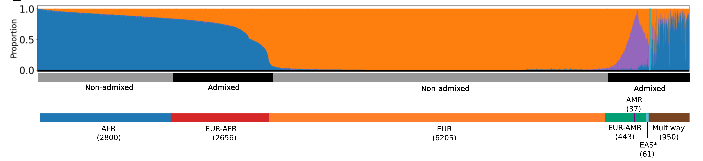
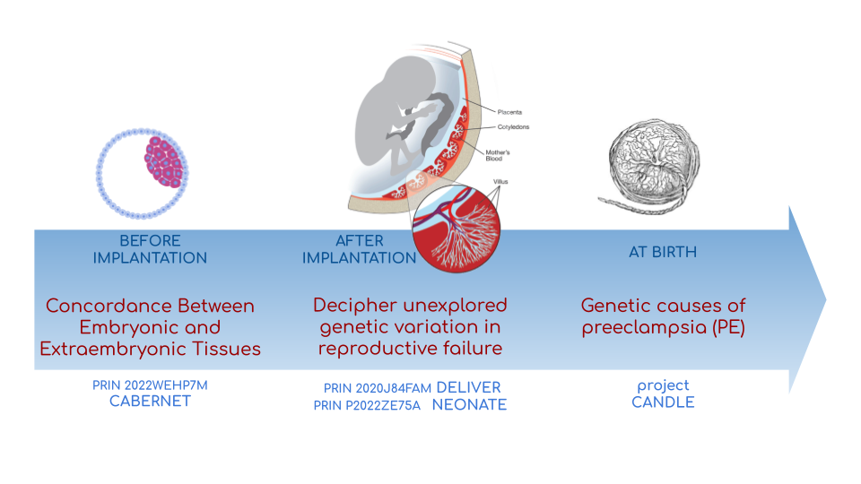
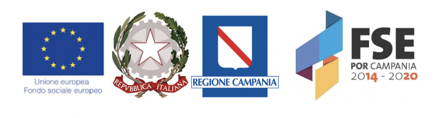
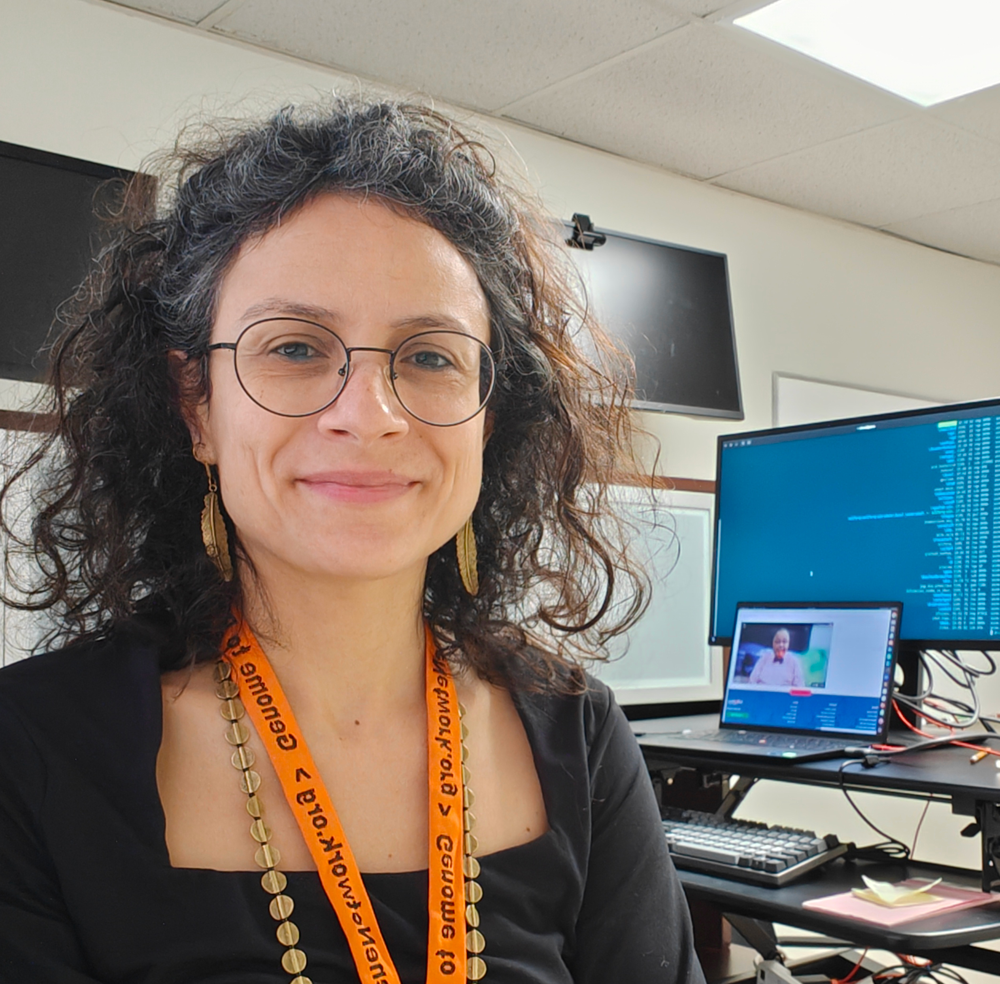
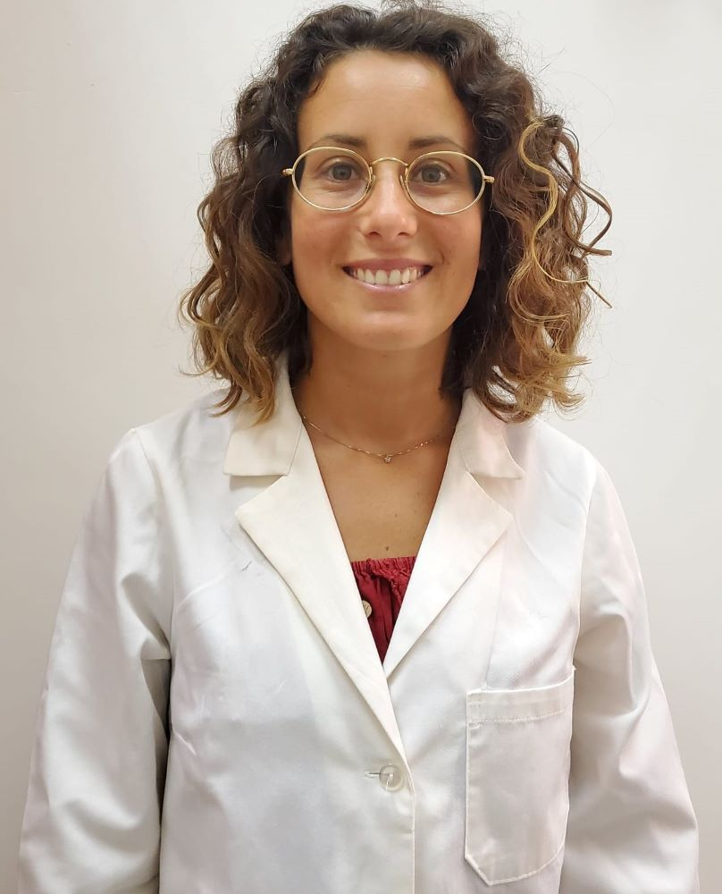
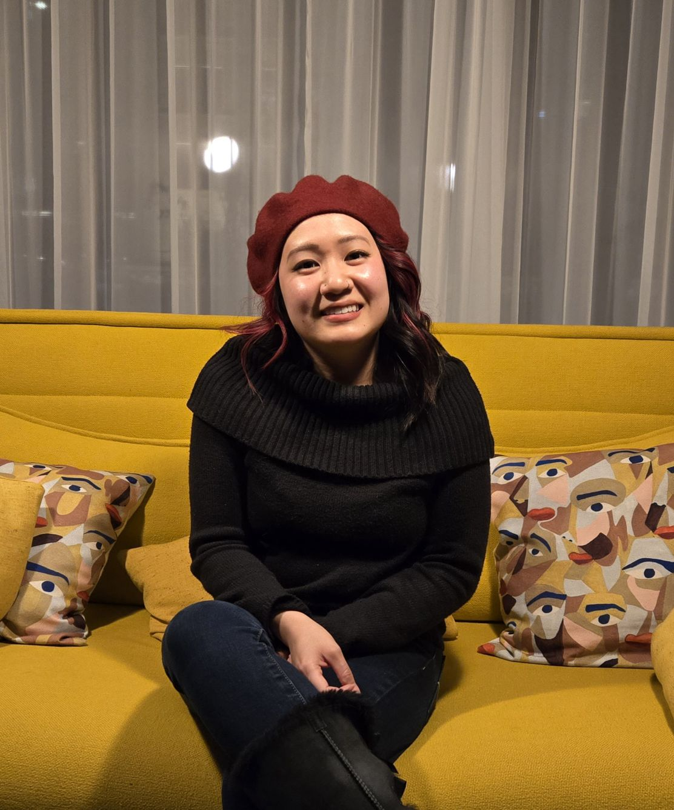

Welcome to the **Population Genomics Laboratory** of Department of
Genetics, Genomics and Informatics at the University of Tennessee Health
Science Center. We are interested in understanding causes and
consequences of genetic diversity and how natural selection in humans
affects loci related to diseases.

> *Fascinating (Lieutenant Spock)*

# **Research**

## Population Genomics and Health Disparities

### The Biorepository and Integrative Genomics (BIG) Initiative in Tennessee

The Biorepository and Integrative Genomics (BIG) Initiative in Tennessee
has developed a pioneering resource to address gaps in genomic research
by linking genomic, phenotypic, and environmental data from a diverse
Mid-South population, in the USA.

BIG is recruiting participants from Memphis, TN, with plans to include a
total of 100,000 samples over the next five years. 
BIG is partnering with 
- the [Genomic Information Commons](https://www.genomicinformationcommons.org/), a consortium of
top children’s hospitals, to conduct genomics research aimed at
discovering the genetic foundations of human disease in diverse
populations.
- Togheter for Change inititive 

### Characterizing Genetic Diversity in the BIG Cohort

Analysis of 13,152 genomes from BIG revealed significant genetic
diversity, with 50% of participants inferred to have non-European or
various types of admixed ancestry, highlighting the importance of
inclusive genomics in understanding health disparities.

*Global ancestry deconvolution of 13,152 sequenced individuals, based
on reference populations in the 1000 Genomes and HGDP data sets. Each
vertical bar represents one individual, colors are proportional to
inferred ancestry. For further analyses, individuals were grouped based
on the ancestry proportions in seven categories (colored bar, number of
individuals per category in parentheses), and classified as admixed or
not (black and gray bar). See the open access 
[paper](https://www.nature.com/articles/s41467-025-59375-0).*

### Identity-by-Descent as a Window into Shared Environment and Health

We use identity-by-descent (IBD) sharing patterns in the BIG cohort to
identify recent shared ancestry and fine-scale population structure.
These patterns help connect inherited genomic segments with shared
environmental exposures and disease risk.

## Population Pangenomics

A pangenome is a comprehensive collection of all the genetic variation
present in a species, which overcomes the limitations of reference-based
genomics by including both common and rare genetic variations in a
single reference genome.

The [Human Pangenome Reference Project](https://humanpangenome.org/)
aims to sequence 300 people to create a pangenome of 600 haplotypes and
has currently released a first draft of the human pangenome reference
based on 47 phased diploid assemblies from a group of genetically
diverse individuals

### Uncharted Genomes

*Well-known population stratification is not visible in the p-arms of
acrocentric chromosomes. This observation is compatible with
recombination occurring between the p-arms of heterologous acrocentric
chromosomes. Here is an example of chromosome 15. AFR: Africans; AMR:
Native Americans; EAS: East-Asians; SAS: South-East Asians.*

Our team evaluated, for the first time, human population
structure using markers from short arms of the acrocentric chromosomes
\[PMID: [37165242](https://pubmed.ncbi.nlm.nih.gov/37165242/)\]. We
found that markers from these regions have less power to distinguish
populations compared to other regions. This is consistent with the
understanding that short arms of acrocentric chromosomes undergo
recombination between non-homologous chromosomes, similar to the X and Y
pseudohomologous regions \[PMID:
[37165241](https://pubmed.ncbi.nlm.nih.gov/37165241/)\]. Our findings on
the patterns of linkage disequilibrium in these regions support this
idea.

### Pangenomics tools for population genetics 

### **Funding**

  - NIH U01HG013760 - Building Tools and Community to Make Pangenomes
    Accessible

## Genomics of early embryonic development

### *How natural selection acts on early human development*

We investigate adverse outcomes of embryonic development like recurrent
pregnancy loss and preeclampsia to identify the genetic factors that
influence reproductive outcomes and pregnancy complications. This
knowledge furthers our understanding of human evolution and informs
efforts to improve pregnancy outcomes.

In **CABERNET** we aim to determine the extent of chromosomal mosaicism
between embryonic and extraembryonic tissues using single cell DNA
sequencing.  
In **DELIVER / NEONATE** we want to identify genetic factors
contributing to reproductive failure and recurrent miscarriage. We will
use single cell strand sequencing to map balanced rearrangements and
whole genome sequencing of euploid miscarried embryos to identify
causative variants.  
In **CANDLE** we want to uncover gene expression patterns associated
with *APOL1* risk alleles and preeclampsia in African American women. We
will examine the role of ancestry in mediating the relationship between
*APOL1* genotype and preeclampsia risk. The results can provide insights
into genetic and molecular basis of preeclampsia.

  - [Francesca
    Antonacci](https://scholar.google.at/citations?user=ceRslzAAAAAJ&hl=en)
    University of Bari Aldo Moro

  - [Carlo
    Alviggi](https://scholar.google.at/citations?user=02eKUFwAAAAJ&hl=en&oi=ao),
    University of Naples Federico II

  - [Antonio
    Lamarca](https://scholar.google.at/citations?user=iukICNwAAAAJ&hl=en&oi=ao),
    University of Modena and Reggio Emilia

  - [Marcella Vacca](https://www.igb.cnr.it/index.php/marcella-vacca/),
    National Research Council

  - [Gabriella
    Lania](https://www.igb.cnr.it/index.php/gabriella-lania/), National
    Research Council

### **Funding**

  - PRIN 2020J84FAM Ministero dell’Universita e della Ricerca

  - PRIN 2022WEHP7M Ministero dell’Universita e della Ricerca

  - PRIN P2022ZE75A Ministero dell’Universita e della Ricerca

  - [Merigen Research s.r.l](https://www.merigen.it/)

  - POR Campania FSE 2014-2020 ASSE III – Ob. Sp. 14

# **People**

## **Vincenza Colonna**

***Associate Professor, Department of Genetics, Genomics and Informatics
[website](https://www.uthsc.edu/faculty/profile/?netid=vcolonna)***  
*University of Tennessee Health Science Center, Memphis, TN*

***Director, Integrative Genomics Biorpository, Department of
Pediatrics***  
*Children’s Foundation Research Institute, Memphis, TN*

***Researcher (on leave of absence), National Research Council
[website](https://www.igb.cnr.it/index.php/vincenza-colonna/)***  
*Institute of Genetics and Biophysics, Naples, Italy*  

***I graduated in Evolutionary Biology from the University of Naples
Federico II and did postdoctoral research at the University of Ferrara
(Italy) and at Wellcome Trust Sanger Institute in Cambridge (UK). I was
lectures in Genetics and Bioinformatics at the University of Ferrara
(Italy). I am now leading the Population genomics laboratory at the
University of Tennessee, College of Medicine, in the Department of
Genetics, Genomics and Informatics.*.**

I am a genomicist and an expert in human evolutionary and population
genomics and bioinformatics. In my postdoctoral research I was part of
the international consortium 1000 Genomes\[PMID:
[26432245](https://pubmed.ncbi.nlm.nih.gov/26432245/);
[23128226](https://pubmed.ncbi.nlm.nih.gov/23128226/)\] where I led
contributions to two specific aspects. First, I contributed to develop
FunSeq \[PMID: [24092746](https://pubmed.ncbi.nlm.nih.gov/24092746/)\],
a tool that integrates non-coding information from relevant biological
databases for the functional characterization of non-coding variants.
Second, I lead a genome-wide scan to identify genomic regions with
exceptionally high levels of population differentiation \[PMID:
[24980144](https://pubmed.ncbi.nlm.nih.gov/24980144/)\] demonstrating
that these regions are enriched for positive selection events and that
one half may be the result of classic selective sweeps. Findings from
both sub-projects have since been applied to demographic inference and
the molecular diagnosis of cancer and myeloid malignancies \[PMID:
[27121471](https://pubmed.ncbi.nlm.nih.gov/27121471/),
[22446628](https://pubmed.ncbi.nlm.nih.gov/22446628/)\], and to deeper
studies on positive selection at the ABCA12 gene \[PMID:
[30890716](https://pubmed.ncbi.nlm.nih.gov/30890716/)\].

During my PhD I worked on human isolated populations contributing to
characterize several isolated populations, describing the genomic
consequences of isolation \[PMID:
[17476112](https://pubmed.ncbi.nlm.nih.gov/17476112),
[19550436](https://pubmed.ncbi.nlm.nih.gov/19550436),
[22713810](https://pubmed.ncbi.nlm.nih.gov/22713810)\], contributing to
genetic association studies \[PMID:
[16611673](https://pubmed.ncbi.nlm.nih.gov/16611673),
[18162505](https://pubmed.ncbi.nlm.nih.gov/18162505)\] and to
characterize rare variation \[PMID:
[28643794](https://pubmed.ncbi.nlm.nih.gov/28643794)\]

I founded and led [OBiLab](http://www.igb.cnr.it/obilab), a project on
training in Bioinformatics

[ORCID](https://orcid.org/0000-0002-3966-0474) |
 [My
GitHub](https://github.com/ezcn) | [Google
Scholar](https://scholar.google.com/citations?user=ufP1EYgAAAAJ&hl=en&oi=ao)

## **Silvia Buonaiuto**, Postdoctoral fellow

**\_ I am a postdoctoral researcher at the University of Tennessee
Health Science Center in the Department of Genetics, Genomics, and
Informatics. Prior to this, I worked as a postdoctoral researcher at the
National Research Council in Italy. I earned a Ph.D. in Molecular
Bioscience from the University of Campania "Luigi Vanvitelli." Before
that, I completed my Master’s degree in Biology at the University of
Naples Federico II, where I conducted my thesis in molecular biology at
the Department of Biology.\_.**

I work on the admixture mapping and pangenomics analysis in the BIG
project. My role involves establishing connections between genotypes and
phenotypes especially in admixed individuals through admixture mapping
analysis. Additionally, I am leading sequence analysis for the projects
related to early embryonic development.

 [My
GitHub](https://github.com/SilviaBuonaiuto) | [Google
Scholar](https://scholar.google.com/citations?user=oGGUawcAAAAJ&hl=it&oi=ao)

## **Franco Marsico**, Postdoctoral fellow

***I earned my degree in Biology from the University of Buenos Aires,
Argentina, where I also completed my PhD in Computational Biology at the
Calculus Institute. My research primarily focused on developing
mathematical models for kinship inference, employing a Bayesian
Approach. I am a postdoc in the Colonna lab, where my work centers on
population genomics.*.**

I am currently working on **Admixture Mapping and Pangenomics Analysis
in the Biorepository and Integrative Genomics (BIG) Initiative Cohort**
project. My focus is on studying recent natural selection signals in
admixed populations. Additionally, I have a deep interest in evolution
and how to compute processes that shape the history of life.

 [Github
profile](https://github.com/MarsicoFL) | [Google
Scholar](https://scholar.google.ca/citations?user=Vd4yh9wAAAAJ&hl=en)

## **Laura Pignata**, Postdoctoral fellow

***I graduated in Molecular Biology at the University of Campania Luigi
Vanvitelli, where I also completed my PhD program in Molecular Life
Sciences. After the PhD I continued my work as researcher, focusing on
the analysis of DNA methylation in imprinting disorders. I am visiting
Dr. Colonna laboratory at the University of Tennessee, College of
Medicine, in the Department of Genetics, Genomics and Informatics*.**

I am working on the analysis of long-read sequencing data on human
samples with mosaic methylation defects. The aim of this study is to
identify the mechanisms underlying the methylation defects by examining
the role of de novo mutations in cis and somatic recombination events,
possibly arisen during early embryogenesis.

[ORCID](https://orcid.org/0000-0001-8835-5567?lang=en)

## **Ernestine Amos-Abanyie**, PhD Student

***I have a master degree in Molecular Biology from the university of
Ghana, I am a PhD candidate in the Biomedical Science program of the
Department of Genetics Genomics and Informatics in co-supervision with
Dr. Ashbrook*.**

I am studying mitochondrial DNA Variation in disease susceptibility in
the BXD Mice and the BIG cohort.

 [My
GitHub](https://github.com/Flavia95) | [Google
Scholar](https://scholar.google.com/citations?user=CRXpC9gAAAAJ&hl=en&inst=1063551842422345302)

## **Donna Vo**, Research associate

***I earned a Bachelor of Science in Microbiology at the University of
Tennessee, Knoxville. I have a background in spoilage detection and
mycology identification in the food and beverage industry*.**

I am in charge of sample collection and processing for the Integrative
Genomics Biorepository that supports the BIG project.

# **Visiting**

## **Giuseppe Comentale**, PhD Student

# **Former members**

## **Lab members**

  - Flavia Villani, Master student, PhD student, 2019-2025

  - Gianluca Damaggio, Master student, PhD student, 2019-2023

  - Rosanna Maione, Research associate 2023

  - Madeleine Emms, Postdoctoral fellow, 2022-2023

  - Marialaura Zitiello, Master Student, 2022-2023

  - Antonella Mecca, Master Student, 2022-2023

  - Angela Sequino, Master Student, 2022-2023

  - Giuliana D’Angelo, Master Student, 2019-2020

  - Roberto Sirica, PhD student, 2015-2018

  - Gaia Leandra Cecere, undergraduate student, 2018

## **Visiting**

  - Dario Cannella, PhD student, visiting student, 2025

  - Angela Carfora, PhD student, visiting student, 2025

  - Davide D’angelo, Visiting master student, 2022

  - Marianna Buonaiuto, visiting Postdoc, 2017

  - Lucia De Martino, visiting master Student, 2016

# **Publications**

See them on [Google
Scholar](https://scholar.google.it/citations?user=ufP1EYgAAAAJ&hl=en&oi=ao)

## **Past Research**

At this
[link](https://github.com/ColonnaLab/laboratory_WebPage/blob/master/docs/pastResearc.adoc)
is possible to found our past Research

# **Contacts**

Vincenza Colonna, PhD

  - University of Tennessee Health Science Center, TSRB room 405  
    71 S Manassas St, Memphis TN 38163
    [map](https://maps.app.goo.gl/XnjsEmoGLyGBTd7b7)

  - Children’s Foundation Research Institute  
    50 N. Dunlap St. Memphis, TN 38105
    [map](https://maps.app.goo.gl/ATEtD8DFUi7oFWeC8)

  - Istituto di Genetica e Biofisica "Adriano Buzzati-Traverso" piano R,
    stanza 11  
    via Pietro Castellino 111 - 80131 Napoli - Italy
    [map](https://maps.app.goo.gl/xD6UzBYSzX45cBSq7)

Email: <enza.colonna@gmail.com> - <vcolonna@uthsc.edu> -
<vincenza.colonna@igb.cnr.it>
